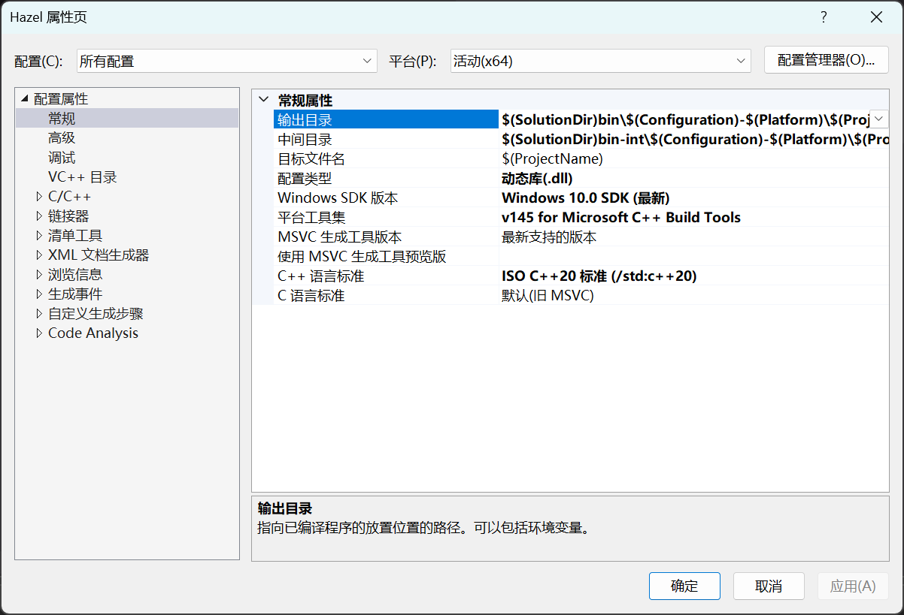

# Hazel

# 项目配置

链接过程选择动态库链接，不选择使用静态库链接是因为，使用静态库链接会把大量无用的代码编译进我们的游戏项目中

这样做大致有两点坏处

1:降低编译和链接速度，所有的代码都要在editor中编译一次再在game中编译一次，但是game中不需要编译所有的游戏引擎的代码，这样会造成性能浪费

2.不能控制哪些代码是引擎私有的，哪些是可以供外部访问的

所以综合考虑下来选择使用动态库链接，在引擎项目的属性中把配置类型设置为动态库即可



所有的配置都设置为64位版本，输出目录指的是最终生成文件的位置，中间目录则是过程中生成的obj文件的位置，把输出目录和中间目录设置为同一个文件夹下的两个文件夹，比默认的设置相比更加简洁，默认设置把所有的中间生成文件放在输出目录外，看起来特别乱

SandBox项目设置和上面基本相同，只是配置类型设置为exe

# 设置项目入口

无非就两种选择，把项目入口设置在SandBox项目中或者设置在Hazel中

如果把SandBox看做是我们的游戏项目的话，想象一下入口设置在这个项目下会出现什么问题。

游戏引擎中会有很多种系统，比如日志系统，内存系统等等，我们的游戏项目是在这个框架下运行的，需要有一系列基于引擎的初始化和基础设置

想象一下，如果入口点设置在游戏项目中，你每次运行游戏的时候都要写Hazel::Init()之类的初始化函数来保证引擎的各种基础功能正常运行，很麻烦，作为游戏开发者根本不需要在意这些不是吗

而且还有一点，假如我们的游戏同时支持安卓版本和window版本甚至支持更多种平台，每次在写游戏项目的脚本时都要写明项目入口应用的是哪个平台，如果有多个平台的话还要写多个入口，你每次写游戏的时候都要写一堆ifdef语句来判断当前游戏是哪个平台的，很麻烦不是吗

如果在引擎中设置入口点就可以避免所有的问题，打个比方就像是制定好了一个框架，所有的游戏项目就像这个框架中的一个小系统，你只要写好这个小系统就行了不用去在意自己的系统之外的东西。

既然已经明确了项目的入口点设置在了Hazel项目下，接着便是搭建我们的框架了

如果要引用动态库中的函数，好比你在动态库中写了一个void a()函数，你如果想在其它项目链接的时候能够找到这个函数，就要在这个函数前打上前缀

`__declspec(dllexport)`

而且在某个项目中应用的时候还要写上

`__declspec(dllimport) void a()` 

如果要链接的函数一多就会很麻烦不是吗，所以需要先解决这个问题

创建一个名为Core的头文件用于做一些预处理工作

```
#ifdef HZ_PLATFORM_WINDOWS
	#ifdef HZ_BUILD_DLL
		#define HAZEL_API __declspec(dllexport)
	#else
		#define HAZEL_API __declspec(dllimport)
	#endif
#else
	#error Hazel only supports Windows!
#endif
```

在该头文件中写下这一段代码，意思是如果定义了HZ_PLATFORM_WINDOWS，意思是如果该平台是WINDOWS系统，就进一步判断是否是需要动态链接的库(是否定义了HZ_BUILD_DLL)，如果需要动态链接，就将HAZEL_API定义为__declspec(dllexport)反之就定义为__declspec(dllimport)

这样，当需要标明某个函数是否需要动态链接时，只需要在前面打上标记HAZEL_API就行了

前提是已经定义了HZ_PLATFORM_WINDOWS和HZ_BUILD_DLL

这里需要打开项目属性设置，在预处理器处定义


Hazel项目需要被动态链接，所以这里定义HZ_BUILD_DLL，而SandBox不需要被动态链接，所以不需要定义这个,由于两者都是在Window平台下的，所以都需要定义HZ_PLATFORM_WINDOWS


之后如果想标明某个函数是否需要动态链接时，只需要在该文件中#include”Core.h”之后使用HAZEL_API就可以了

由于项目入口点需要设置在Hazel项目中，在Hazel项目中创建一个EntryPoint的头文件，用于处理项目入口点。(把所有Hazel引擎中的东西都定义在Hazel这个命名空间下，别问，好习惯)

之后需要在Hazel项目中设置一个Application类，所有的游戏项目都继承自这个类

既然是所有游戏项目的基类，不妨想一下一个游戏项目都需要有什么内容

游戏项目需要不停的保持窗口运行，所以肯定要有一个Run函数，在Run函数中有一个while循环来控制游戏循环，不同游戏运行的效果肯定不一样，所以Run函数需要是一个虚函数。

构造函数和析构函数肯定也是要有的，析构函数需要被设置为虚函数(目前不知道为什么，后续补充)


这里还有一点很关键的没有说，入口点被设置在了Hazel中，那么在入口点中该如何运行我们的游戏项目呢。

先假定我们有一个游戏项目SandBox，同时定义了一个SandBox类，这个类继承自Application类，在运行的时候我们当然希望调用SandBox→Run()，所以说在我们的项目入口中需要创建一个SandBox类，无论我们的游戏项目具体是一个什么类，都需要执行这个Run函数，所以显然我们需要一个基于当前游戏项目类型的对象，之后调用这个对象的Run函数即可

所以需要一个CreateApplication函数用来创建基于当前类型的游戏项目，主函数中大概是这样调用的

auto app=CreateApplication()

app→Run();

delete app;

所以在我们的Hazel命名空间中需要声明一个CreateApplication函数


这个函数在游戏项目中设置对应的定义


显然在入口点中需要声明这个函数，之后再从外部找到这个函数的唯一具体的定义

所以在Hazel中需要写，extern表示这个函数仅仅是一个声明，其实和不写extern是一样的，只是为了增加可读性


Hazel.h文件中包含了游戏项目所需要的所有引擎框架


在游戏项目中定义或者使用某个引擎中的功能时，只需要写一个”Hazel.h”就可以了，不需要写密密麻麻的头文件，增加可读性

搭建好基本的框架是很重要的，能给以后的开发省很多事

写项目框架时的总结:

基本的要求：

1.各个模块的功能要解耦，不能彼此混淆在一起

2.明确各个模块之间的依赖关系，继承关系

3.对哪个模块大概要在哪里调用，要做个预想

在此基础上，尽可能保证代码的可读性和代码的简洁