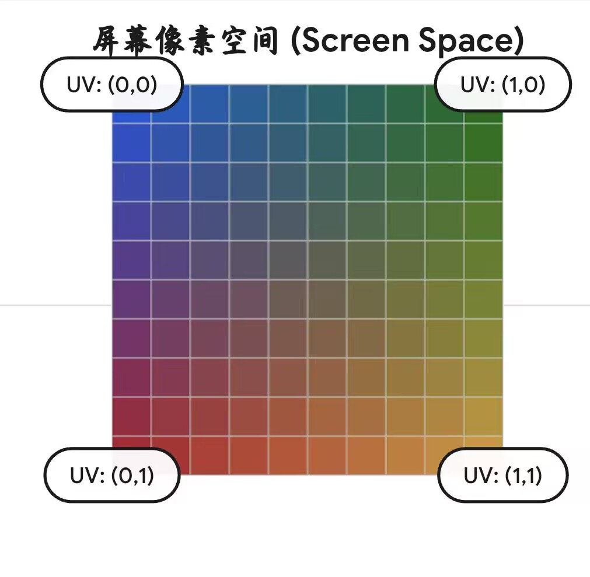

# OpenGL

## 顶点缓冲区的创建

1. 为顶点缓冲区分配id：

buffer用来存储缓存区的id序号

glGenBuffers为buffer分配唯一的id序号

glBindBuffer函数将buffer这个id序号接到GL_ARRAY_BUFFER这个通道上

glBufferData为这个缓存区分配对应的空间（第一个参数GL_ARRAY_BUFFER表示通道的类别，第二个参数表示的是开辟缓存区空间的内存大小，第三个参数为传入的数据，第四个参数表示不改变传入的顶点坐标信息）

glEnableVertexAttribArray打开对应的shader通道

glVertexAttriPointer就是告诉OpenGL对应的shader通道是什么，刚刚所做的操作只是开辟了空间大小，OpenGL本身并不知道我们传入的数据该怎么处理(好比我传入了一个float类型的数组，这个数组存储了六个数据，但是这在OpenGL看来只是普通的六个数而已，它不知道要怎么处理)，glVertexAttriPointer就是干这个的，这里顺带解释一下这六个参数是什么意思

### glVertexAttriPointer

第一个参数index：由于顶点可以有很多属性，除了坐标位置外，还可能有纹理，法线等等，这里的0表示的是把这组数据当成坐标处理

后来的补充:当时理解的是对应的通道只能传对应的属性，但其实每个通道之间的区别只是通道的id号不同而已，它们本质上都是用来传输数据的通道而已，无论传什么类型的数据都行，比如:你不仅可以在0号通道中传入顶点坐标属性，也可以在0号通道中传入颜色属性，或者在1号通道中传入顶点坐标属性，这是无所谓的

第二个参数size：表示这个坐标有几个属性，由于此处是二维平面，所以一个坐标只有两个参数(x,y)

第三个参数:表示传入的属性为浮点数类型

第四个参数normalized:由于在顶点着色器中，对顶点的属性有时采用标准化坐标计算(0~1之间的浮点数)，这个参数便是表示是否要对该属性做标准化处理，GL_FALSE表示不对该属性做标准化处理，GL_TRUE表示对该属性做标准化处理

第五个参数:这个参数指的是从一个属性跳到下一个属性的步幅，假设我们这里是连续三个二维平面的顶点坐标信息，由于一个坐标是由两个float类型的变量表示的，从一个坐标到下一个坐标之间的内存偏移量就是这个stride，相当于告诉OpenGL，每隔一个stride跳到下一个属性

第六个参数pointer:指的是读取数据的起始位置

后来的补充:这里需要注意一个区别，glVertexAttribPointer只记录规则，它并不实际读取，真正的读取是交给了glDrawArray去执行的，你可能不明白我说的什么意思，这里打个比方

如果glVertexAttribPointer负责实际的读取，如果我使用for循环

例如for(int i=0;i<3;i++)

{

…….

glVertexAttribPointer(i,………);

……..

}

用来读取不同的通道，在这种情况下，由于for循环的逻辑，我们读取0着色器通道，再读取1着色器通道，再读取2着色器通道

但实际情况是，glVertexAttribPointer只负责记录读取规则

当你在调用glDrawElements/glDrawArrays的时候

这三个着色器通道的读取规则已经规定好了，之后开始同时读取

你可能会问，glVertexAttribPointer只指定规则不读取，这样有什么实际的应用意义吗

之前我们定义的positions这个属性中只单一存储了坐标属性，但在实际的应用中，其实在一个数组中可以存储多种属性，除了坐标，还有纹理，法线等

现在的布局是{P1,P2,P3,P4}但其实实际布局还可以是这样{P1,T1,P2,T2,P3,T3,P4,T4}

在读取的时候，使用for循环同时给所有的通道指定读取规则，好比坐标属性的通道的步长为2*sizeof(float)+sizeof(unsigned int),每隔两个坐标和一个纹理属性(其实我现在不知道纹理属性用什么数据类型，假设为unsigned int)，再读两个坐标，同样纹理属性的通道步长也是这么个大小，两个通道同时开始读同一个数组，不用一个通道先读，一个通道后读

对这个过程做一个形象的比喻:申请的缓存区id就像是一个u盘，GL_ARRAY_BUFFER就是usb插槽，你的所有操作都是通过这个插槽传给u盘的，只有当u盘插上插槽之后你才能对其进行操作，而且一个插槽只能查一个u盘

## 创建着色器(shader)

由于顶点着色器和片段着色器这两者往往是一起工作的，需要因此需要创建一个program，之后把顶点着色器和片段着色器”贴”在这个program中

在cherno的教程中，编译着色器和创建着色器/program被封装为了两个函数

### CompileShader

和创建顶点缓冲区的时候类似，shader在创建的时候也需要为其分配一个唯一的id

unsigned int id = glCreateShader(type);这段便是为着色器分配唯一的id标识

紧接着下面这一行代码开起来可能比较让人困惑，它其实就是将一个string类型的变量转变成了const char*这种原始的字符串类型，因为OpenGL是由C编写的，cpp的字符串不能作为参数传入

glShaderSource这个函数就是创建了shader的资源，把你写的需要编译的shader代码加载进了GPU中，1表示的是只有一串字符串，&src_cstr这个便是传入了src_cstr的指针，因为这里要传入一个字符串指针 ，而src_cstr本身是字符串的首地址，所以这里传入了一个二级指针,最后的那个NULL其实指的是字符串的长度，这里如果填NULL或nullptr的话指的是读到最后的\0停止

glCompileShader(id)便是对shader进行了编译

这样我们就成功编译了一个shader

注意到这里写了//TODO

因为着色器的编译其实不像visual studio那样会报编译错误，也就是说如果你的代码哪里写错了，你完全不知道，这里的作用其实就是做一个错误检查，如果shader代码编译错误了，你能在输出终端中看到报错信息，便于排查问题

result用来表示是否出现编译错误

这里使用if语句来判断，如果出现了编译错误(result==GL_FALSE)，则进一步输出编译错误信息，如果没有编译错误，则直接跳过

glGetShaderiv这个函数中的第一个参数id，指的是你需要访问的shader唯一id序号，GL_COMPILE_STATUS指的事查看编译状态，之后把这个结果传递给result

条件判断语句内的下一行代码，int length用于存储编译信息的字符串长度

message则将编译的报错以字符串的形式存储，这里并没有使用创建数组的方式来创建字符串数组，因为我们创建的数组长度是length，length本身是变量，而数组初始化的大小不能是一个变量，所以这里使用alloca的形式开辟连续的内存空间，之后强制转换为char*类型以满足需求

glGetShaderInfoLog这个函数的参数中，id指的是shader的唯一序号，第二个参数length其实指的编译信息的最大长度大小，第三个参数就有些让人困惑了，因为这里必须传入一个指针类型的变量，用来表示实际存储了多少个字符（第二个参数指的是存储字符的容量上限，第三个参数指当前存了多少个字符）因为接下来的一步便是将错误信息传给message，岁我们不需要知道当前实际存了多少个字符，这里cherno为了偷懒传进了&length，实际在当前情况下传什么指针都可以(哪怕是nullptr)

最后就是输出message，返回0(表示shader编译失败)

### Createshader

由于需要将shader创建在program下，所以CreateShader函数首先需要创建一个program，使用glCreateProgram（）创建program

接下来就是用之前写好的CompileShader一键创建shader

glAttachShader（program,vs_id）这段代码的意思是将你创建的id为vs_id的shader”装”进你创建好的program里，glAttachShader(program,fs_id)同理

glLinkProgram()：之前我们提到，顶点着色器和片段着色器是不能单独工作的，他们需要被连接在一起才能工作，glLinkProgram便是链接的关键，这个函数的参数中只需要填入你创建的program的id便可以，但是在调用该函数之前，一定确保你已经用glAttachShader把你创建的着色器挂在了这个program下，不然会出问题

glValidateProgram（program）:这里其实就是做了一个安检，举个例子，假如你在使用glLinkProgram之前，没有将对应的着色器挂在你创建的program下，此时glValidateProgram便会给你报错

glDeleteShader:你的shader其实已经创建完毕了，你可以把你创建好的shader类比为一个exe文件，exe文件的运行不依赖中间生成的obj文件，shader也类似，当你shader创建完毕后，你就可以把你的中间文件给删除了，不然留着会影响性能

## 编写着色器

你可能注意到了，我们是以字符串的形式传入着色器的代码的，但是这样做的话有很多坏处，你可能写着写着就少了一个换行，或者少了一个分号，而且也没有visual studio的高亮提示

所以一般情况下我们可以采用另一种方式来编写着色器代码，待会会讲到，现在先解释一下这段代码是什么意思

#version 330 core其实就是一个版本声明

layout(location=0),这里其实刚好对应了之前创建顶点缓冲区时的通道id(就是glEnableVertexAttribArray(0))，表明你的这个着色器是零号通道，顶点缓冲区通过这个通道使用对应的着色器

in表示后面这个参数是接收数据的，也就是接收你之前传入的position数据(这里的这个position只是变量名，它的名称可以是任意的)，vec4则是这个变量的类型声明，表明这个变量是一个四维矢量，你也许会问，我传入的是一个二维坐标，为什么这里会用到四维矢量，其实这里会对你传入的二维坐标进行自动补全，除开你传入的x，y方向的数据，y,z 方向上被自动补全为0.0,1.0

void main()和cpp的main函数类似，这里是程序的入口

gl_Position是着色器的内置属性，指的就是你顶点的坐标位置，这里其实能解释为什么要用四维矢量，因为这个内置属性就是一个四维的矢量，这里将你传入的坐标信息赋给了这个内置属性

片段着色器代码的编写也类似，这里稍微有一些不同的是，因为片段着色器负责渲染每个像素上的像素颜色，所以这里的color是一个输出的变量out，而且没有对应的内置属性,这里为什么没有对应的gl_color属性，未来会说到(画饼=v=)，你可能还会问，为什么着色器就知道你的这个变量对应的就是颜色这一属性呢，其实这就与layout有关，片段着色器的通道编号如果是零，那么对应的输出属性就默认为颜色

## 以读取文件文本的形式读取着色器代码

为了解决刚刚提到的直接在源文件中写着色器时遇到的不便，cherno给我们提供了一种解决方案:

单独创建一个shader文件，之后在里面一次性编写完着色器代码，最后在源cpp文件中使用fstream库和sstream库以字符串的形式读出文件中的shader代码

先单独创建一个res文件夹，再在其下创建一个shader文件夹(这里其实无所谓，但这样其实是一个好的习惯，方便你管理项目)，之后在shader文件夹里单独创建一个尾缀为.shader的文件

之后在shader文件中写入你的shader代码，按之前的原封不动的搬过来就可以，只不过这次不用加引号和换行符了，但是需要注意，我们需要在不同的着色器代码区域打上对应的标签，你马上就会知道为什么

先解释一下这个函数的大致思路吧，我们需要返回两个字符串，但是默认的函数只能返回一个对象，这里自定义了一个结构体，里面有两个字符串类型的成员变量用于存储我们的两个字符串，返回的时候只需要返回这个结构体对象就可以了，这样就可以一个函数同时返回多个值,这个函数的参数便是你的存放shader代码的文件路径，建议使用相对路径，这样就避免了因为项目路径更改而引发的不便

之后便是一行一行从文件中从文本形式读取shader代码，在这个过程中我们需要某种方式来区分你写的是Vertexshader代码还是fragmentshader代码，cherno在每个着色器的代码前都加了#shader “着色器名称”这种形式的标签，如果读到某一行有#shader就表明这里是某个着色器代码的起始部分，如果找到vertex或者fragment就更新type，这里的type是一个枚举类，这里cherno的用法非常巧妙，type起到了一人分饰两角的作用，既可以记录当前着色器的类型，又可以充当ss数组的索引(这里的ss是std::stringstream类型，这种类不单纯只是一个string，它是以流的方式处理字符串的（一个string流），因此在返回字符串值的时候，还需要用str()函数将对应的stringstream转化为字符串的形式输出

补充:ifstream其实就是input file stream，以输入的形式使用这个文件，getline(stream,line)则是以字符串的形式逐行读取stream，并把每一行的结果存入line中，使用while循环就是如果不为空就一直读，find()函数接收一个字符串类型，查找当前字符串中有没有对应的内容，如果没有的话就返回std::string::npos(no position)，有的话返回索引位置

## 索引缓冲区

由于在根据顶点绘制图案的时候，GPU只能绘制三角形，也就是说如果你传入正方形的四个顶点，GPU不会按你所想的那样绘制正方形，如果你想使用顶点缓冲区绘制正方形，你需要创建六个顶点，也就是绘制两个直角三角形，这样的话会造成性能浪费，明明绘制一个正方形只需要四个顶点就够了，结果我却要创建六个，如果只是绘制一个正方形倒还好，如果是绘制一个角色模型呢，那需要大量的三角形面，有无数个重叠的顶点，会造成相当大的性能浪费，OpenGL当然考虑到了这一点，索引缓冲区便是为了解决这一问题而生的

索引缓冲区的逻辑，其实就是按顶点缓冲区顶点的一定顺序进行绘制，好比你有四个顶点要绘制一个正方形，顶点的索引为0,1,2,3你可以按012顺序绘制一遍，再按123顺序绘制一遍，这样就得到了一个四边形，不需要创建六个顶点，要想有索引，必须先有顶点，因此在创建索引缓冲区之前，确保对应的顶点缓冲区已经创建

创建索引缓冲区的方法和创建顶点缓冲区的方法类似，先创建一个unsigned int类型的变量用于存储 唯一id，其余基本相同，只是缓冲区的通道变成了GL_ELEMENT_ARRAY_BUFFER,你可能会问，为什么传入了索引的数据它就知道我的各个顶点对应的索引是什么呢，这里其实有一个默认顶点顺序，分别按你传入坐标的顺序是0，1，2，3，你也许还会问，为什么它就知道我的默认顶点顺序是什么呢，因为你已经在GL_ARRAY_BUFFER通道插上了buffer，索引缓冲区会根据这个通道上的buffer的数据定好默认顺序

当你改为使用索引缓冲区绘制时，需要更改一下绘制的函数,将glDrawArray改为glDrawElements，第一个参数表示绘制的为三角形， 第二个参数是绘制的次数，第三个参数指的你传入的索引数据类型，第四个参数需要传入一个指针，如果传入的为空指针，它就会自己去对应的缓冲区获取对应的数据，如果你传入的不是空指针，则会根据你传入的这个指针去找对应数据

## 如何使用glGetError处理OpenGL中的编译错误

因为OpenGL不像visual studio那样会给你报错，你在OpenGL中的错误默认你是不知道的，好比刚刚的glDrawElements函数，假如第三个参数你写的是GL_INT类型，这显然是一个错误，因为这里需要你写你的索引数据类型(unsigned_int)，但如果你没有意识到你的错误，你又点击了运行，你的hello world窗口以及输出终端中就什么也没有，没有绘制好的正方形也没有报错信息，我们当然不希望这样，我们想要的是像visual studio那样的报错，让我们知道哪里的代码写错了

glGetError函数内部存储着当前所有的错误标识，好比你的OpenGL编译时出现了三个错误，glGetError中便存储着这三个错误标识，但你每次调用的时候，只会返回其中的一个(之后glGetError中的这个错误标识便被移除了)所以需要不停的调用以返回所有的错误标识，不过这里有个问题，glGetError返回的错误码不会像visual studio那样标出来你哪里错了，它就是一个单纯的错误码，如果你一次性返回了很多错误，你怎么能知道对应的错误是在哪个位置发生的呢

这里我们可以写两个函数，一个函数用于清除所有已经有的Error标识，一个函数用于输出错误码，当我们想知道某行代码是否有错误的时候，只需要在这行代码之前删除所有的错误标识，在这段代码之后重新输出错误码即可，如果有错误码的话那只能是这行代码出错了

每次你想看某行代码是否有问题的时候都这样插入GLcleanError和GLCheckError未免太麻烦了，因此可以使用宏来简化

ASSERT(断言)，接收一个参数，后面是判断，如果条件为真则触发断点，反之不触发

__debugbreak是MSVC编译器自带的一个函数，用来触发断点

这里对GLCheckError函数做了一个修改，传入三个参数，一个是函数名，一个是文件名，一个是函数所在行数，__FILE__和__LINE__都是编译器自带的变量，前者是当前代码所在文件的文件名，后者是当前代码所在的行数

GLCALL(x)对之前的GLCleanError()和GLChecnError()的使用做了个简化，这样之后再次调用直接用GLCALL(这里填入你想查看的函数)即可

## 统一变量

当我们希望shader中的某个变量可以通过cpu中的指令访问时，便可以使用统一变量uniform

统一变量在物理层面上是属于整个program的，也就是说，在同一个program下，无论你在哪个着色器中创建了这个同一变量，它都属于整个program，并且每个变量都有唯一对应的location(假如你在vs中声明了一个名为a的uniform，在fs中声明了一个名为a的uniform，并且他们都是vec4类型，那么这两个变量其实就是同一个)。

统一变量的location是怎么确定的呢，其实当你在创建这个统一变量的时候，它的location就已经确定的，如果你没有显示声明layout(location= n,n为你想要的location)，那么系统会自动给你分配一个location，OpenGL通过这个唯一的location地址查询这个location下所在的变量

glGetUniformLocation()这个函数中，第一个参数填你要查询的program唯一id，第二个参数填你要查询的统一变量的变量名，之后返回一个location地址

glUniform的第一个参数是location，第二个参数是你想传入的值，它通过location访问这个地址里存储的变量，因为OpenGL在查询统一变量的时候依赖的就是location地址，它不看别的，也就是说如果你在同一个location下存储了多个统一变量，此时很可能会出问题，因为OpenGL不知道这个值要赋给这个location下的哪个变量

此处我声明的同一变量是一个vec4，也就是说我需要在第二个位置填入四个分量，这里任意一个分量都可以用变量来替代，你可以在这个函数之外控制这些变量从而控制颜色的变化。但是有一点需要注意的是，此处的颜色更新是取决于你的电脑帧率的，因为你更新变量大概率会把它放在while主循环中，如果你不想修改变量的变化逻辑，比如设定每次循环r值增加或减少0.05，但是又希望颜色变化的可以慢一些，我们就可以通过使用glfwSwapInterval来控制显示器的帧率

## glfwSwapInterval

这个函数的作用，其实就是控制垂直同步

函数的参数接收一个整数，这里为了解释这个函数的作用原理，需要解释一下电脑的画面是怎么刷新的。

双缓冲机制:

- **前置缓冲区（Front Buffer）：** 显示器当前正在读取并显示在屏幕上的那一帧画面。
- **后置缓冲区（Back Buffer）：** 你的 GPU 当前正在拼命渲染的新一帧画面。

当GPU的后置缓冲区画完后，OpenGL会通过glfwSwapInterval交换缓冲区，把后置缓冲区绘制好的画面更新在前置缓冲区上，但问题就是，显示器更新画面是从上往下一行行像素扫出来的，如果你的GPU(后置缓冲区)的绘制速度过快，显示器还没把这一次的前置缓冲区绘制完，就绘制更新好的后置缓冲区的话，就会导致显示器显示的一部分是上一次前置缓冲区的画面，一部分是刚刚后置缓冲区绘制好的画面，其实它有个我们更熟悉的名字，画面撕裂

为了避免这种情况，我们可以像glfwSwapInterval中传入一个整数，它控制的是缓冲区的交换时间间隔，意思是，需要等待几次屏幕刷新交换一次缓冲区

`glfwSwapInterval(0)`：彻底关闭 VSync

假如你的显示器最高帧率是240帧，而你向glfwSwapInterval中传入的整数为0，此时就相当于完全关闭了垂直同步，你的电脑帧率能跑多高跑多高，但就像前文所说的，难免会造成画面撕裂。

`glfwSwapInterval(1)`：开启标准 VSync

如果你的参数填的是1，表示显卡无论绘制的多快，也必须等屏幕绘制完一次后才能交换缓冲区，如果你显示器的最高帧率是240帧，那么此时最高帧率就被锁在了240帧

`glfwSwapInterval(2)` 或更高：降频锁帧

2意思是无论显卡绘制多快，也要等屏幕绘制两次之后才能交换缓冲区，如果显示器最高帧数是240，那么此时的最高帧数就被锁在了120,参数数值更大时依次类推

`glfwSwapInterval` 作用于当前的 OpenGL 上下文

必须在创建窗口，OpenGL上下文创立完毕后，才能写glfwSwapInterval

## 顶点数组对象(VAO)

顶点数组对象你可以把它想象成一个笔记本，它记录着顶点缓冲区的地址以及读取规则，在OpenGL3.3兼容版本中（这里只是拿Cherno教学视频中的版本举例），它有一个默认的顶点数组对象，所以在你创建顶点缓冲区和索引缓冲区之前，你不需要创建一个顶点数组对象，但是OpenGL3.3

核心版本中并没有提供这样的一个默认顶点缓冲区对象，如果你此时绑定了顶点缓冲区和索引缓冲区的话，不出意外地会报出编译错误

先来谈一下为什么OpenGL设计了顶点数组对象这样一个东西吧，在OpenGL早起的版本中，其实并没有这样的一个概念

早期版本中，你渲染图形的时候，需要在主循环中不断调用glBindBuffer,glEnableVertexAttribArray,glVertexAttribPointer这三个函数，但是我们在之前的教学中，可以注意到，这三个函数写在主循环外面是没有问题的，现代版本中不需要在主循环中反复规定顶点缓冲区读取规则的原因就是因为顶点数组对象

想象一下，假如你的顶点缓冲区的读取规则是固定的，为什么要在主循环中反复调用glEnableVertexAttribArray和glVertexAttribPointer呢，如果有很多个顶点缓冲区，每次循环都调用一次这两个函数，这是额外的api开销,会造成不必要的性能浪费，所以才有了顶点数组对象(VAO)

顶点数组对象本身就像一个快照相机，当你每次调用glVextexAttribPointer的时候，它就会把此时顶点缓冲区的状态以及索引缓冲区的地址记录下来，之后GPU的读取管线便会去读顶点数组对象中记录的顶点缓冲区的地址以及读取的规则，依据顶点数组对象中存储的数据绘制

由于你每次调用glVertexxAttribPointer的时候，顶点数组对象都会记录此时顶点缓冲区的地址以及读取规则，同时也会记录索引缓冲区的地址，因此只要更新一次，顶点缓冲区上便会一直记录着这些数据，你无需重复调用glVertexAttriPointer，哪怕你把glVextexAttribPointer，glBindBuffer,glEnableVertexAttribArray这几个函数完全删除，只要顶点数组对象之前记录过一次顶点缓冲区的数据，OpenGL也能正常编译并绘制图案

### 如何创建一个顶点数组对象

和创建顶点缓冲区类似，先声明一个unsigned int类型的变量存储要创建的顶点数组对象的唯一id，之后使用glGenVertexArray分配唯一id，glBindVertexArray绑定顶点数组对象

如果你的OpenGL版本中没有默认顶点数组对象需要自己创建，务必把顶点数组对象的创建放在顶点缓冲区的创建之前，前面说过，因为每次你调用glVertexAttribPointer的时候会把数据记录到顶点数组对象中，如果你没有设定顶点数组对象，此时OpenGL大概会出现编译错误

## 顶点缓冲区和索引缓冲区的封装

封装的目的是为了更简单地调用代码，同时使代码的结构变得更加清晰，Cherno教程中带着我们封装也是出于这个目的，这里暂时不考虑后续扩展的情况，只考虑在我们目前已有代码的基础上进行封装

在封装的时候可以优先考虑封装的这个对象的功能是什么，我们需要调用的接口是什么，然后把对应的接口写在头文件中，之后再单独创建一个同名的cpp文件用来定义对应的函数，这样可以使我们的思路更加清晰

先解释一下为什么先在头文件中声明对应的函数再在对应的cpp文件中定义函数，这不单单是代码风格的问题，如果你把所有的接口都在头文件中声明，之后你使用这个头文件的时候，会把接口原封不动地调用过去，如果你在多个cpp文件中都使用了这个头文件，对应的代码将会重复编译，浪费性能

如果是现在头文件中声明再在对应cpp文件中定义，当你调用对应的接口时，每次都通过链接调用cpp文件中的唯一接口，避免了重复编译

cherno在对以前代码进行封装的时候，是直接复制粘贴过去的，我们自己封装的时候建议重写一遍，你大概会发现前面的某些函数已经忘的差不多了

### Renderer.h

这个头文件目前主要用于处理OpenGL中的编译错误(因为GLALL会贯穿整个OpenGL的使用)和后续画面的更新

### 顶点缓冲区的封装

假设我们有一个顶点缓冲区的头文件，我们希望创建顶点缓冲区的时候可以自动为其分配唯一的缓冲区id，但这个id又不能被外界直接访问，可以将其设置成类的私有成员，在构造函数中自动为其分配唯一id

创建顶点缓冲区的时候，需要使用glBufferData为缓冲区存入数据并分配大小，可以在创建顶点缓冲区实例的时候通过构造函数传入data和size，自动分配大小，在构造函数中也自动绑定缓冲区

这里Bind()接口单独写出来是为了方便以后其他接口的调用，UnBind用来手动解除缓冲区的绑定

这里便是具体api的定义，和之前在Application中写的内容几乎一致

这里的const表示只对类的成员变量进行读取，不更改

你可能会问，为什么glVertexAttribPointer和glEnableVertexAttribArray这两个函数没有在这里封装，在调这两个函数的时候，确定了顶点缓冲区的布局，而顶点缓冲区的布局实际上是由顶点数组对象负责记录的，我们希望把顶点缓冲区的布局存储交给顶点数组对象来处理，在后面顶点数组对象封装的时候才封装这两个函数

### 索引缓冲区的封装

与之前顶点缓冲区的封装几乎一致，将分配id，创建缓冲区，为缓冲区分配空间的功能都集成在了构造函数中，Bind()同样是为了方便其他接口的调用，UnBind()则是解除索引缓冲区的绑定，这里往索引缓冲区中写的索引个数是count，之前的顶点缓冲区对应位置写的size，cherno习惯把个数用count，而把占据的内存空间大小用size表示

## 顶点数组对象和缓冲区布局的封装

之前说过，顶点数组对象在glVertexAttribPointer和glEnableVertexAttribArray这两个函数调用的时候记录顶点缓冲区的地址和布局，按照面向对象的设计哲学，既然顶点数组对象负责了缓冲区布局的读取，我们就把这两个函数封装在顶点数组对象中

cherno这里把缓冲区对象单独分装，是考虑到我们以后可能会在cpu中读取缓冲区的布局，比如通过顶点缓冲区的布局来做碰撞检测，单独封装缓冲区的布局有助于后续的调用

而顶点数组对象的功能主要是读取缓冲区的布局

这样大致就有了封装的思路

缓冲区布局用来存储缓冲区的布局，顶点数组对象读取并记录缓冲区的布局

### 缓冲区布局的封装

先想一下当我们告诉顶点缓冲区它的布局的时候，都需要哪些信息

1.需要知道数据对应的哪个着色器通道

2.需要知道传入了多少个数据

3.需要知道传入的数据类型

4.需要知道数据是否经过标准化处理

5.需要知道步长

6.需要知道从哪个地址开始查询

其中着色器通道，是否经过标准化处理，一般是有默认规则的

我们知道顶点着色器的不同通道表示顶点的不同属性，比如零号通道表示顶点的坐标

而顶点的坐标一般用浮点类型的数据表示，浮点类型一般也不需要通过标准化处理

所以cherno这里希望通过判断你在布局中存储的数据类型，自动判断对应的着色器通道和是否需要标准化处理，不需要单独的参数传入和在缓冲区布局对象中存储

除去了这两个信息，就剩下四个布局信息了，传入数据的个数，传入数据的类型，步长以及查询首地址，而步长和首地址又可以通过数据类型和传入的数据个数进行计算

实际真正需要记录的布局信息就只有传入数据的个数和数据类型，其它数据都可以据此推断

单独创建头文件VertexBufferLayout来存储数据信息，创建VertexBufferElement来表示单个布局类，主要存储两个信息count(个数)和type(类型)，normalized根据type自动判断

由于顶点缓冲区可能有多个，布局也可能有多个，最适合用来做容器的对象便是vector，动态更新存储数组的个数，由于我们存储的布局可能具有不同的数据类型，需要根据数据类型的不同动态地存储布局，于是在这里使用了template，你可能会问，在调用函数的时候直接把数据类型顺带作为参数填入不行吗?答案是肯定的，当然可以，但是使用template有很多好处

在定义模版的时候，可以通过static_assert来在编译期就显示错误，假如你使用传参的方式写这个函数，需要存入的布局数据类型是unsigned int类型，结果你写成了float，结果编译期你没发现这个错误，而在程序运行的时候可能就出现了一系列问题，在模版中使用static_assert就起到了一个未雨绸缪的作用，不仅如此，如果你将数据类型作为参数传入，你还需要在函数定义中写很多条件判断分支，这产生了一定的性能开销，使用模版则是在编译期就确定了函数，避免了性能开销，你可能又会问，我用函数的重载不行吗，函数的重载确实能够避免条件判断，但是函数要想重载，必须填入对应类型的参数，想象一下，你每次调用Push的时候，除了传入count，你还需要传入一个数字启用函数重载，浮点型要写Push(count ,任意一个浮点数)，这看起来会非常奇怪，调用的时候也不美观

综上所述，template是最优的

这里的template <typename T>表示要创建一个函数模版， template<>下面的函数都是这个模版的不同具体实现

你也许惊讶的发现我们这里将步长作为了这个类的私有成员，而不是作为VertexBufferElement的私有成员，因为步长是所有的布局所共用的，而不是某个单一布局的属性

举一个之前的例子

在实际应用中，顶点的属性往往是交替排列的，假设我的一个数组存储了顶点的坐标属性，纹理属性

坐标纹理属性交替布局，数组长这样

{P1,T1,P2,T2,P3,T3}

那么无论是顶点属性通道的步长，还是纹理属性的步长，他们的大小都是同一个值

所以步长是所有布局统一的，不应该设置成某个单一布局的成员变量

这里步长的计算也是基于这个原理，每加入一个新的布局，m_Stride就加上这个布局中数据类型的size

### 顶点数组对象的封装

和顶点/索引缓冲区类似，创建顶点数组对象的时候我们同样希望自动分配唯一id，顶点数组对象的删除则由析构函数自动处理

此处着重解释一下AddBuffer函数

我们将缓冲区布局和顶点数组对象的封装解耦，造就了这个富有美感的函数

这个函数有两个参数，一个是之前封装的顶点缓冲区对象，一个是之前封装的顶点缓冲区的布局

顶点数组对象的作用就是记录某个顶点缓冲区布局的读取规则

在学习顶点数组对象之前，学习顶点缓冲区的时候，我们就写了glVertexAttribPointer和glEnableVertexAttribArray，但是在当时我们是不知道这两个函数和顶点数组对象息息相关，甚至在讲解顶点数组对象的时候可能也没有意识到这一点

这个函数的两个参数很好地体现了顶点数组对象的实际功能，当你想通过顶点数组对象记录对应的读取规则时，你不用再复杂地调用glVertexAttribPointer，只需要通过这个函数，填入你想记录的缓冲区，再填入这个布局，就对这整个功能进行了实现，而且意图也特别明显，十分利于理解，它很好地表达了顶点数组对象，顶点缓冲区，顶点缓冲区的布局这三者之间的关系

这个函数也不复杂，先绑定对应的顶点缓冲区，之后获得这个缓冲区所有属性的布局(使用引用避免了拷贝)，之后设置了所有布局的读取规则

这里的offset可能有点不好理解，还是拿之前那个属性交错排列的数组举例子

{P1,T1,P2,T2,P3,T3,P4,T4}这里是两个属性，i为2(先push坐标属性，类型为float，再push纹理坐标属性)

结合这个for循环来看，第一次循环，设置坐标属性的读取规则，因为我们的坐标属性是从数组的第一个位置开始读的(注意，是此时只是指定读取规则，没有真正读取)，所以offset是0，第二次循环中，设置纹理属性的读取规则，纹理属性是从第二个位置开始读的，第一个元素跳过去了，所以offset为size*element.count。

### 着色器的封装

在封装shader对象时，同样先考虑要简化什么步骤，实现什么功能，这里不考虑用于游戏引擎的那种复杂的着色器对象，我们只对之前写过的和shader有关的代码进行封装就可以了，不添加新的功能

回顾一下创建着色器对象时的几个步骤

1.需要读取着色器文件，得到字符串格式的着色器资源

2.创建着色器对象

3.创建program，用program链接着色器对象

4.统一变量的设置

5.使用program

创建program需要的变量有

1.着色器文件的文件路径 

2.着色器的字符串资源

3.着色器的个数以及对应类型(在目前的情况下是固定的)

4.program的id

因为目前我们只有顶点着色器和片段着色器这两种着色器，而且同一个program下目前只绑定了这两个着色器，这些步骤是固定的，不需要额外传参，而着色器的字符串资源又是通过文件名获取的，所以在创建着色器的时候实际上只需要传入一个文件名就可以了

m_FilePath和program的id设置为shader的私有成员，因为他们都需要被多个函数调用，且不希望外界访问和更改

将之前的ParseShader和ShaderProgramSource直接复制过来，用于根据文件名获取着色器资源

CompileShader和CreateShader和之前一样，CompileShader创建着色器，CreateShader创建program并自动连接

Shader这个构造函数只负责创建program，glUseProgram的过程单独写在Bind函数里，这里函数名还是为Bind是为了和之前封装的其它对象的接口名字保持一致

只有设置统一变量这里稍稍有些不同

之前在设置统一变量的时候需要先根据名字查找这个统一变量的location，之后再调用对应的函数设置统一变量的值，其实这两步完全可以整合到一起

先看看我们这两步需要哪些参数

1.统一变量的名字，2.program的id(这两个用于查找location)

3.location,4.传入的值(这两个用于设置统一变量的值)

在我们这个类中，Shader实际上是创建了一个program，并且program的id是私有成员且在创建时已经分配了，第一步是需要查找location，这一步需要id和统一变量的名字，第二部需要通过location和传入的值设置统一变量的值

在封装好的接口中，只要我们把统一变量的名字作为参数传入，location便能找到，进而便能设置统一变量的值

所以这个接口的参数很明确了，传入一个name，传入需要设置的统一变量的值

最后的一个小优化便是使用了哈希表，想像一下，如果每次调用GetUniformLocation的时候都需要重复查找location，虽然没什么问题，但这确实产生了一些开销

因为glGetUniformLocation这个函数是在cpu和gpu之间对某个变量进行操作的，而类似这样的行为会浪费性能，最好的方案是在cpu中优先处理数据，尽可能少地减少数据传输

大哥比方，cpu与gpu之间有一座大桥，而你只有一辆卡车来通过这座桥运输数据，如果你一次只运一个数据，1000个数据你得运1000次，而你如果把1000个数据实现处理好，一次运过去，这样效率就快了很多

cherno这里使用了哈希表，这个其实很像python中的字典，通过键值对的方式来查找数据，每次我们查找location的时候，先去哈希表中看看是不是存储了对应的location，如果存在，就不需要再往gpu里找了，反之则把这个location存在哈希表中

这样可以避免重复调用glGetUniformLocation

对以上封装的过程的一些总结

大致思路是:想象封装的对象都有哪些功能，列出实际需要的参数，隐藏不必要的过程，同时尽量保证接口的简单易懂

## 如何写一个渲染器类

这里只是简单地封装了一下

渲染器类就是负责绘制，在绘制之前我们需要做哪些工作，创建一个顶点数组对象，制定对应绘制规则，创建索引缓冲区，创建一个shader

大体来说，绘制需要顶点数组对象，索引缓冲区，shader

为了简单起见，就传入这三个变量即可

之后依次调用shader.Bind(),va.Bind,ib.Bind()，最后进行绘制即可，绘制时传入是索引缓冲区的索引个数是ib的私有成员m_count

glClear这个函数就是删除当前显示的画面，之后重新绘制，如果之后我们绘制的图片需要是动态的话一定要在主循环中加上这个，不然永远绘制的是一开始的画面

由于目前写的渲染器类确实比较简单，所以暂时写到这里

## 纹理

在创建我们的纹理之前，我们需要使用到stb_image库，在github上直接复制到我们自己的stb_image.h头文件中即可，注意官方要求的使用规范

在屏幕上显示我们的纹理之前，需要先准备一张2d图片，stb_image库中支持的图片格式有

.png  .jpg  .tga  .bmp  .psd  .hdr  .gif

创建两个文件texture.h,texture.cpp，就像之前对其他对象封装一样，我们也要对纹理类进行封装

同一个纹理对象中(暂时只讨论2D图片),大致有三个比较重要的属性

图片的高，图片的宽，图片的每像素位是什么

这里解释一下每像素位是什么意思，大致意思就是每个像素可以用多少个bit来表示

每像素位表示的就是用多少个bit来表示这个颜色

1-bit，每个像素只有黑和白两种颜色(2的一次方)

8-bit，每个像素有黑到白之间过度的256种颜色(2的八次方)

24-bit（ “真彩色 “），

- **红 (Red)：** 占 8 位（0~255 的红光亮度）
- **绿 (Green)：** 占 8 位（0~255 的绿光亮度）
- **蓝 (Blue)：** 占 8 位（0~255 的蓝光亮度）

32-bit（带有 Alpha 通道的真彩色）
 24 位的 RGB + 8 位的 **Alpha 通道（透明度）**。

每个纹理插槽也有对应的纹理id，同时需要一个unsigned char*类型的数组来存储所有的图片数据(将图片转换为对应的最原始的字节)

所以这里需要设置五个私有成员变量，m_TexFilePath用于存储图片路径

创建纹理之前的第一步就是通过stb_image库把纹理的对应数据存储在我们的cpu中

但是在使用stbi_load函数存储图片数据之前，需要使用stbi_set_flip_vertically_on_load(1);将图片上下翻转过来，这是因为在传统的图片格式中，图片的(0,0)处坐标指的是图片的左上角，而在OpenGL中，图片的(0,0)处位置是从左下角开始绘制的，如果不将图片进行翻转的话，你最终画出来的图像就是完全颠倒的

在Texture的构造函数中，使用列表成员变量初始化设置对应变量的默认值，将图片翻转过来之后，使用stbi_load读取对应路径下的图片数据并存入m_LocalBuffer中，传入m_Width,m_Height,m_BBP是因为stbi_load函数会将图片的长，宽以及每像素位写入对应的变量中供我们后续调用

glGenTextures分配对应的纹理槽位id，glBindTexture绑定对应的纹理id

接下来的glTexParameteri函数则是制定了纹理的采样规则

glTexParameteri(GLenum target, GLenum pname, GLint param)

这个函数长这样，target表示的是你绘制的纹理的类型，由于这里我们绘制的是一个2d图片，所以直接写GL_TEXTURE_2D就可以，param是你制定的具体的采样规矩，而pname则是用来说明你制定的是哪个方面的规矩

例如GL_TEXTURE_MIN_FILTER指的是在图片缩小时的采样规则，而GL_LINERAR则是指在缩放过程中保持线性过度

(这里解释一下线性过度是什么意思(个人理解)，好比我们的图片是一张16*16的图片，但是我们的屏幕中，如果想把这个图片放大的话，对应位置的像素就会变得一个一个地很明显，像马赛克。同样，如果这个图片缩小得特别小，那么这个图片看上去就丢失了很多像素，线性过度则指的是在屏幕上，对应位置的像素缩放之后该是什么颜色，好比我的16*16的图片缩放为了8*8的大小，那么压缩后的图片每个像素的颜色就是之前这个像素周围四格颜色的叠加)

同理，GL_TEXTURE_MAX_FILTER就是指的图片放大时的采样规则

GL_TEXTURE_WRAP_S则是指图片在水平方向上如果图片的纹理坐标越界了怎么办

GL_TEXTURE_WRAP_T则是指图片在竖直方向上如果纹理坐标越界了怎么办

这里设置为GL_CLAMP_TO_EDGE指的是向边缘处平滑过度

glTexImage2D的作用就是cpu像gpu中传入图片数据(这里是m_LocalBuffer)，这个函数中有足足九个参数，从前往后分成四组依次来解释这九个参数是什么意思

glTexImage2D(GL_TEXTURE_2D, 0, GL_RGBA8, width, height, 0, GL_RGBA, GL_UNSIGNED_BYTE, localBuffer);

第一组:传递数据的基本信息,GL_TEXTURE_2D表示传递的纹理是一个2d图片类型，width和height则表示传递过去图片的宽和高

第二组:GL_RGBA8指的是GPU内部的存储格式，而GL_RGBA则指的是CPU的发送格式，GL_RGBA8指的是有四个通道，每个通道按8bit存，而GL_RGBA则表示cpu中是按4个通道的格式存储的

第三组:type这里指存入GPU的数据类型，data则是一个数据指针，就是那个m_LocalBuffer

第四组:

**`level` (多级渐远纹理的层级):**

在 3D 游戏里，远处的物体不需要用高清大图，所以会生成一套越来越小的“缩略图”（Mipmap）。这告诉 GPU 当前传的是哪一层。

**传原图，永远填 `0`。**

**`border` (边框):**

早在几十年前它是有用的，但在现代 OpenGL 里，官方规定 **这个值必须填 `0`**

glDeleteTextures和stbi_image_free这两者都负责删除存储的图片数据

不一样的是，stbi_image_free删除的是在cpu中存储的图片数据，而glDeleteTextures则删除的是GPU中存储的图片数据，当你把图片数据传给GPU之后，cpu中的图片数据就可以删除了，当你不需要GPU绘制这个图片时，再使用glDeleteTextures来删除gpu中的图片数据

Bind和UnBind都没什么好说的，glActiveTexture函数用来激活对应的纹理插槽，由于OpenGL中允许的纹理插槽为32个，从GL_TEXTURE0到GL_TEXTURE31,这里参数为slot传入GL_TEXTURE + slot则是用来激活对应的纹理插槽，比如Bind(0)是激活零号插槽，Bind(2)则是激活2号插槽

封装好对应的Texture类之后，就是重写shader了

重写shader的目的就是让采样器(sampler)获取对应位置的像素颜色，之后按这个颜色进行绘制

这里需要解释一下纹理坐标(uv)，纹理坐标的x，y坐标可以简单的理解为这个图片在某个方向上的相对位置，好比图片的x方向上中间位置的坐标为0.5，最右侧位置的坐标为1.0，它就像是把一张图片从0-1切成了很多份，用从0-1之间的小数来表示在每个方向上的所有位置

不过纹理坐标也是能超过1的，这里先不讨论这个(其实是目前还不太懂=v=)

还记得之前我们创建的顶点缓冲区中，顶点有对应的纹理这个属性吗

在顶点着色器中，这个属性对应的是1号通道，也就是layout(location=1)

我们需要在之前创建的layout对象中，再push一个纹理属性的布局

之后将positions更改一下，新加入对应的纹理坐标

顶点坐标和纹理坐标间隔插入是为了方便顶点数组对象读取，一个一个读完顶点的所有坐标属性和纹理坐标属性，如果感觉迷惑的话可以再复习一下我们封建的顶点数组对象是怎么指定读取规则的

更改顶点缓冲区的大小

我们得让着色器知道使用了哪个纹理插槽，所以需要传入一个统一变量来传入这个采样插槽的id

在shader类中添加SetUniform1i函数

这里是一个采样插槽，不是一个整数插槽，设置统一变量为整数的原因是因为sampler会根据这个整数去找对应的纹理插槽，例:传入0就找0号插槽，传入1就找1号插槽

新增的部分:

layout(location=1) in vec2 TexCoord;

这里的location=1表示1号着色器通道，把之前我们读取到的对应顶点的纹理坐标传了进去，并赋值给了TexCoord，out vec2 v_TexCoord则是将TexCoord赋给v_TexCoord并传出，但这里有一个误解，它并不是直接传给了片段着色器，而是先传给了光栅化器，光栅化器将图片切开成许多份(可能几十万份，可能几百万份，反正很多)，之后再将每一份的uv坐标流入v_TexCoord,texture则是获取在对应纹理插槽的uv坐标下的颜色，之后交给片段着色器绘制

后续补充:其实所有从顶点着色器到片段着色器的数据都经过了光栅化处理，只有能被光栅化的数据才能传到片段着色器中，像int这种类型的数据就是不行的

## 混合

在渲染图形的时候，如果你的画面上原本就有了一些图案，当你在渲染新的图案的时候，如果你没有开启混合，而且你绘制的新图案恰好在原来已有图案的上方，那么从视觉上来看，就是原来的图案完全被新图案覆盖了，假如你有一块红色玻璃，需要盖到原先的蓝色画布上，你当然希望红色玻璃盖上去之后看到的是紫色而不是完完全全的红色，混合就是用来实现这个功能的

glEnable(GL_BLEND)

glBlendFunc(src,dest)

glBlendEquation(mode)

glEnable(GL_BLEND)是用来打开混合模式，如果要混合的话一定记得用这个函数

glBlendFunc(src,dest)则是用来指定混合的规则

具体的公式是这样的：

$C_{result} = (C_{source} \times F_{source}) + (C_{destination} \times F_{destination})$

C_source表示的是新加的图案的颜色，C_destination表示的是原先已经存在的图形的颜色，C_result表示的是计算后的颜色

而F_source和F_destination分别表示传入的两个参数src和dest，你可以简单地理解为权重，好比你把F_source设置为1，F_destination设置为0，就表示你希望新添加的图案的颜色占比为1，而原先的颜色占比为0，从视觉表现上来看，就是新来的图案完全覆盖了原先已有的图案

一般情况下，如果不需要覆盖，最经典的颜色混合方式是GL_SRC_ALPHA(src=0,6),GL_ONE_MINUS_SRC_ALPHA(dest=0.4)

补充:其实这里的颜色计算公式是针对每个通道单独计算的

对于RGBA模式来说，计算公式是

R_result=(R_source * F_source) + (R_destination * F_destination)

G_result=(G_source * F_source) + (G_destination * F_destination)

B_result=(B_source * F_source) + (B_destination * F_destination)

A_result=(A_source * F_source) + (A_destination * F_destination)

glBlendFunc这个函数则是制定了混合的运算模式

具体有以下五种运算模式

**1. `GL_FUNC_ADD`（默认状态）**
• **方程式：** C_result = (源) + (目标)

**2. `GL_FUNC_SUBTRACT`（减法混合）**
• **方程式：** C_{result} = (源) - (目标)

**3. `GL_FUNC_REVERSE_SUBTRACT`（反向减法混合）**
• **方程式：** C_{result} = (目标) - (源)

1. **`GL_MIN`（取极小值）**
• **方程式：** C_{result} = min(源, 目标)
2. **`GL_MAX`（取极大值）**
• **方程式：** C_{result} = max(源, 目标)

## OpenGL中的数学

计算机图形学中需要一些线性代数相关的知识，但在Cherno的OpenGL系列中并没有涉及底层的理论知识，更多的只是告诉我们各个矩阵的作用，所以这里也不对底层的数学理论进行解释，但是希望在接触投影矩阵，视图矩阵，模型矩阵之前，已经知道了线性变换的几何意义，这会让你更容易理解这些矩阵在这里真正做了什么事，而且对后续的学习会有所帮助

学习线性代数的一些基本知识建议去看3BlueBrown的线性代数系列

这里的矩阵的创建与运算同样用的glm库，

### MVP(模型视图投影矩阵)

MVP其实是Model matrix View matrix Projection matrix的缩写，依次为模型矩阵(Model)，视图矩阵(View)，投影矩阵(Projection)

投影矩阵将2d或3d世界投影到我们的计算机窗口中，视图矩阵常常用来模拟相机，模型矩阵用来模拟物体的变化，但它们其实都是一种幻觉，都是通过线性变换来模拟我们在窗口中想要看到的画面

### 投影矩阵(Projection)

投影矩阵的作用用一句话概括就是，规定了在3维空间中需要渲染的立方体空间以及投影的类型(透视投影还是正交投影)

想像一个三维的空间，你拿着一个相机在这个三维空间中拍照，拍出来的照片并不是3维的，它其实是2维的，照片的作用就和投影矩阵类似，投影矩阵将3维空间的场景经过变换后存放在我们的2窗口中。

在OpenGL中，在三维世界中投影到我们窗口的空间是有限大的，想象你正在玩一款3d游戏，远处的纹理肯定不可能完全渲染出来，而左右侧视觉范围外的一部分空间肯定也不会渲染，在你视觉范围的后边你看不到的地方，也不用渲染，把这个可以渲染的空间看成是一个立方体，OpenGL中规定的这个立方体的长宽高都被标准处理为1

在之前渲染纹理的过程中，我们渲染一个正方形时，设置正方体的顶点分别为(0.5,0.5),(0.5,-0.5),(-0.5,-0.5),(-0.5,0.5)而我们窗口中的最左下角为(-1,-1），右上角为(1,1)，如果顶点位置的x,y坐标超过了1,那么这个顶点是一定不会被渲染的，因为我们可渲染空间x，y轴的范围被划在了-1到1之间。

而投影矩阵可以改变这个渲染空间(其实并没有改变，渲染空间实际还是标准化的，只是矩阵计算做了一个巧妙的变换，感兴趣的可以自行学习，这里不讨论数学原理)

这里创建了一个正交投影矩阵，正交投影矩阵和透视投影矩阵这两者的区别就是是否满足透视原理，在现实世界中，距离我们越远的物体看起来越小，同时越向视线中心靠拢，透视投影矩阵将投影模拟成我们现实世界中看到的那样。而正交投影矩阵则相反，无论远近，所有的物体均保持同样的大小不变，正交投影矩阵常常被用在2d画面或者游戏ui中，这里由于我们用的是一张2d图片不涉及3维空间，所以只讨论正交矩阵

glm::ortho创建了一个正交矩阵，它接收了六个参数

这六个参数相当于重新规定了渲染空间，最左侧的两个参数表示渲染空间的宽度，由于这里是2d图片，所以这里的实质作用就是把原先我们窗口中x方向的最左侧改为了-2.0，最右侧改为了2.0，中间的两个坐标则重新规定了窗口最上方和最下方的y坐标，最右侧的两个参数规定了z轴方向的渲染空间(这里你可能会问为什么2d空间不把这里填成0.0f,0.0f，这牵扯到了矩阵运算模拟物体平移的数学原理，如果填成0，就无法实现物体的平移，感兴趣的可以自行学习)

在shader中设置一个四阶矩阵类型的统一变量，将每个顶点的坐标和这个变换矩阵相乘(注意矩阵运算中的线性变换一定要按顺序左乘矩阵)，这个投影矩阵的变换就起作用了

之后你就可以把我们窗口的左下角坐标当成(-2.0,-2.0)右上角坐标当成(2.0,2.0)了，同样，如果你的投影矩阵是这样创建的

glm::mat4 proj=glm::ortho(0.0f,960.0f,0.0f,640.0f,-1.0f,1.0f)

那么这个窗口的最左下角坐标就变成了(0.0,0.0)最右上角的坐标就变成了(960.0,640.0)

### 视图矩阵(View)

视图矩阵用来模拟相机，但实际上相机并不存在，同样，想象一下你正在用手机拍照，正对着一个物体，当手机向右移动的时候，手机中的物体在手机窗口中就是向左移动了

视图矩阵其实就是对这个过程做模拟，在这个角度上，视图矩阵的作用其实就是将物体向相机移动的相反方向平移，这里单独使用视图矩阵而不是用两个模型矩阵其实就是为了以后封装相机对象，将相机的移动和物体的移动二者解耦

如果我想让相机向右移动100个像素，我只需要将物体向左移动100个像素即可

在glm库中，translate函数表示平移，它的第一个参数接收一个矩阵，第二个参数接收一个三维矢量表示平移的距离和方向，glm::mat4(1.0f)是创建了一个四阶单位矩阵，这里不解释数学原理

### 模型矩阵(Model)

模型矩阵用来表示物体的变化，比如旋转(Rotate)，缩放(Scale)，平移(Translate),通常用

model= T * R * S，T,R,S分别表示平移矩阵，旋转矩阵，缩放矩阵，这里顺序不能错了，顺序表示变换的顺序，一般都是按这个顺序，变换的顺序不一样会产生不一样的结果

这里只进行平移

当创建完这个三个矩阵之后，就创建一个矩阵(通常命名为mvp)用来表示这连续的三个变换

注意相乘的顺序不要搞错了

如果只使用投影矩阵，将投影矩阵赋值给之前创建的统一变量，那么绘制的图形位置大概是这样

使用视图矩阵和模型矩阵之后，位置大概这样就是相机向左移动了100像素，物体向右移动200像素再向上移动200像素的结果

简单总结:MVP中对应的三种矩阵，投影矩阵规定了需要渲染的空间以及渲染空间是否满足透视规则，视图矩阵用来模拟相机的变化，模型矩阵用来模拟物体的变化

## imgui

imgui为我们的渲染窗口提供了一个可视化的编辑界面，这样就不用在启动应用和编辑实际纹理之间来回切换了，更加方便，这里不会解释imgui的各个参数和原理，暂时只需要知道怎么用就可以，后续写各种测试的时候会解释用到的imgui函数

### 批渲染

批渲染大致有两种方式，第一种是再创建一个顶点缓冲区，索引缓冲区，纹理缓冲区

第二种是修改我们的模型矩阵，在一次循环中对同一个对象进行两次绘制，只不过这两次绘制对应的模型矩阵不同，所以绘制的纹理位置就不同

这两次绘制被包含在两个作用域中，主要的原因是因为代码风格，容易区分这两次不同的绘制

在每一次绘制的时候，屏幕上的纹理图案并不会消失，所以用同一个shader多次绘制同一个图形是允许的，打个比方这就像同一个画手在一张纸上画两个相同的东西，两个都画完了之后才换另一张纸继续画

## 建立一个测试框架

现在我们成功绘制了纹理，顶点缓冲区，索引缓冲区，顶点数组等等概念也已经摸清楚了，就像cherno所说，基本有了把各种东西整合到一起的能力，但问题就是，现在我们的application.cpp文件中看起来很乱，虽然比封装各种抽象类之前要整洁了不少，但还是很乱

所以理想状况是建立一个测试框架，当我们需要哪些内容时，比如我想绘制一个三角形，或者我想绘制一个纹理，我就点一个绘制纹理的按钮，然后我能创建一个纹理区域，还能通过ui按钮更改这个纹理的个数，大小，位置等等

为了实现这样的功能，我们可以创建测试框架，后续各种测试都在这个框架的基础上建立。

就拿2DTexture的test来举例，思考一下建立一个CleanColor测试框架都需要哪些东西，首先需要一个开始菜单，就命名为TestMenu，在这个菜单中需要展开一系列我们要测试的按钮，比如测试CleanColor的按钮，测试2D Texture的按钮

当点进2D Texture这个按钮之后，会渲染对应的纹理图像，同时根据Slider来改变该图像的位置，大小，旋转角度等等

所以每一个test最主要有两个函数，一个用来渲染我们的图像，另一个则用来渲染imgui的界面,其实还可以有一个函数用来更新图像的状态，比如计算图像的位置等等

所以在我们的test基类中，需要有三个函数

OnRender(渲染我们的图像)

OnImGuiRender(渲染imgui画面)

OnUpdate(更新图像状态)

test基类的构造函数和析构函数其实不需要构建什么内容，这些是需要在子类中进行构建的

用虚函数是为了在继承时子类对这些函数进行覆写

接下来就是创建testMenu，写好基础的框架，剩下的东西就很简单了

在cherno的教程里，他想实现的是每次点击一个对应的test，就切换到那个test，换句话说，在进行的test只有一个。

创建test这里有两种方案

第一种，在运行的时候就创建所有的test，只不过所有的test都保持静止不运行，只有当前的test保持运行

第二种是在点击对应test按钮的一瞬间创建test

这里我们选择后者

如何设计一个testMenu类呢，如果先入为主的话，你会很自然的想到，testMenu的作用不就是显示所有的test，并且点击对应test按钮时更新当前的test吗，这样很容易让我们想到，testMenu是一个单独的类，和test没关系，因为它不需要测试，只渲染需要一个Imgui的菜单就可以了，为什么cherno却让它继承自test类呢，这在直觉上看感觉是没有关系的(你可能没有这样的疑问，但我当时真的有这样的疑问)

我认为比较好的解决方式，是先暂时放下这个问题，或者说你就按testMenu是一个单独的类来思考，看看在接下来构建框架的过程中，会遇到什么问题

上面说到，在窗口中我们只希望看到一个test的ui界面，当前的test只有一个，所以需要一个

Test* currentTest指针来指向当前的test，即用一个currentTest指针来和当前的test绑定

(这里如果我们按testMenu是一个单独的类来思考的话，就产生了第一个问题，因为当前的imgui窗口只有一个，而currentTest只能指向一个Test类，没法用它来同时指向我们的testMenu类，需要一个额外的指针来指向我们的menu，而且还要判断menu是不是当前唯一的imgui窗口，而如果testMenu继承自test类，这些问题就迎刃而解了，只需要一个currentTest就可以指向所有的imgui窗口)

在testMenu中我们要显示的只是对应test的按钮，一个按钮大概有两个功能，一是显示对应的test类型，二是点击之后切换到对应的test界面

这里需要讲一下ImGui::Button(const char* name)这个函数,这个函数接收一个字符串，同时判断该name下的按钮有没有被点击，并返回一个bool值，如果这个button根本就不存在，它会先创建一个对应名称的button，之后再根据是否被点击返回bool值，如果被点击则返回true，如果没有被点击则返回false

接下来就可以很自然地想到，我们需要注册当前所有的按钮，再通过对应的按钮是否被点击来判断是否要切换到对应的test界面，同时更新我们的currentTest指针

那么当前test的渲染和状态更新的工作何时做呢，该把这个功能放在哪个区域呢

我们有一个currentTest指针指向当前激活的test，而且每一个test的画面渲染和状态更新显然要实时进行，所以应当把更新当前test的功能放在画面渲染的主循环中，并且我们只需要更新当前test的状态就可以了，不需要在乎其它的

更新test状态的部分大致长这样

ImGui::Begin(”Test”)这个函数，作用是创建一个名为Test的imgui窗口，它一定是和ImGui::End()绑定使用的，这段代码的意思是，如果currentTest存在，便执行OnUpdate和OnRender函数，之后创建一个名为Test的窗口，如果这个窗口不是testMenu, 就创建一个返回的按钮”←”,并判断这个按扭是否被点击，如果被点击就更新currentTest指向testMenu，之后再调用OnImGuiRender()

不要把OnImGuiRender函数放在ImGui::Begin函数之前，因为在Begin函数执行之前，还没有创建一个imgui的窗口，如果此时进项ImGui窗口内容的更新，由于压根就不存在imgui窗口，它会自己创建一个名为Debug的窗口，这个窗口是多余的也没什么用

（如果testMenu继承自test，那么这里的代码不会改变，这一段代码可以同时应对所有的场景，但如果testMenu不是继承自test，前面说过我们不仅需要一个指针来指向testMenu还要判断testMenu场景是否被激活，在这里还要编写单独的imgui窗口渲染逻辑）

整体的框架基本清晰了，现在需要做的就是写好testMenu类，同时写好注册test的函数，以及思考以何种方式创建一个test场景

每个按钮都绑定唯一一个名称和唯一一个test场景，cherno在这里的处理方式是用vector来存储元组，每个元组有两个对象，一个是name，一个是该name下对应的lambda表达式(这个函数用于创建对应的test场景)

其实还有很多别的解决方式，比如用很自然地可以想到用vector存储所有的test场景名称，之后先判断是哪个按钮被触发的，然后根据被触发的按钮的名称来写一堆条件判断语句调用对应的创建test场景的函数，但是cherno用的这种方法是非常简洁且直观的

由于注册不同的test场景时的代码逻辑完全一样，只是注册的场景类型不同而已，所以这里考虑使用template

template<typename T>

void TestRegister(const std::string& name)

{

m_Tests.push_back(std::make_pair(name,{return new T;}));

}

TestRegister这个函数调用时是这样调用的

return new T这里的T便是在对应尖括号内填入的具体类型

testMenu→TestRegister<test::TestCleanColor>(”Clean Test”)就是注册了一个名为Clean Test的按钮，同时创建了一个TestCleanColor的对象

记得在最后删除所有的test场景

首先删除当前的场景，如果删除的当前的场景不是testMenu，再删除testMenu,(其余的test场景在点击←按钮时候已经删除了)

### 创建CleanColor测试

框架写好了之后，无论创建什么样的测试场景都很简单了，TestCleanColor场景是最简单的，只需要一个私有成员变量记录当前的颜色向量，再用glClearColor记录当前的颜色，之后用`glClear(GL_COLOR_BUFFER_BIT);`绘制就行了，glClear这个函数的作用是删除当前绘制的所有东西，之后把背景板的颜色绘制成上次glClearColor记录的颜色就可以了

构造函数中初始化m_ClearColor,由于这个测试场景很简单，所以析构函数和OnUpdate函数里面甚至不需要有什么功能

### 创建纹理测试

创建一个纹理需要顶点缓冲区，索引缓冲区，顶点数组对象，shader，以及对应的纹理图像数据，顶点数据，索引顺序等等

我们之前已经把顶点缓冲区这些东西封装好了，创建一个纹理测试，就是把之前创建纹理的代码集合到这个测试场景里而已，没什么新东西

这里建议尝试自己构建，也是对之前学过内容的回顾

## 批渲染

回想一下之前是怎么绘制两个相同的纹理的，我们只是使用了两次DrawCall函数来对同一个对象进行两次绘制，如果绘制的对象多了，并且绘制的对象也不相同，那该怎么办，只是多次调用glDrawCall会使程序变得非常慢，而且也没办法绘制不同的纹理。

拿比较简单的绘制两个不同的正方形来举例，如果不重复调用DrawCall函数，还有什么办法

我们可以把所有的顶点数据放在一个顶点缓冲区中，换句话说，把要绘制的两个正方形看成一个整体，看成一个单一的几何图形，矩阵变换都对这一整个几何图案进行处理(就像你在移动相机视角的时候，肯定是所有的几何图形都跟着一起变换了)

只需要把所有顶点的数据都放进顶点缓冲区中，之后再用索引缓冲区指定绘制的顺序就可以了

但这样你也许会产生一个问题，颜色呢，纹理呢，也都做统一处理吗，如果我要绘制的两个图形有不同的颜色或纹理该怎么办，我们通过统一变量传入的值针对program中的所有着色器，没法让某个着色器通过统一变量接收一个和其它着色器不同的值啊，就好比我把统一变量u_a中传入了一个颜色(1.0f,1.0f,1.0f,1.0f)，那么所有的着色器都接收了这个颜色，片段着色器接收的颜色是一样的，绘制出的图案颜色也是一样的，没办法绘制不同的图案或者颜色啊

要解决这一问题，就需要知道一点:

顶点着色器通道只是一个接收数据的管道

而每个顶点着色器都按顶点数组对象中记录的读取规则来读取顶点缓冲区中的数据

换句话说，你可以把不同的数据传入不同的顶点中去，(不止法线，纹理坐标,只要是数据，理论上都能传过去)

如果前面的知识都搞明白了，这一部分并不难，知道了理论知识后完全可以自己写

### 批渲染-颜色

假设你有索引依次为0,1,2,3,4,5,6,7的八个顶点，前四个顶点构成一个正方形，后四个顶点构成一个正方形，你可以在前4个顶点中传入一种的颜色，在后四个顶点中传入另一种颜色，之后再分别发送给片段着色器，这样，同一个program下的片段着色器就能绘制不同的颜色了

你也许会产生一个问题，顶点着色器的个数对应着顶点的个数，我有八个顶点对应有八个顶点着色器，但是片段着色器可不止八个，在绘制的图形中有数不尽的片段着色器，从顶点着色器中传出的颜色数据，是怎么被这么多片段着色器接收的?

这里就要提到光栅化了，从顶点着色器传输到片段着色器之间的数据都要经过光栅化处理，上文中，我们向一个正方形的顶点中传入了相同的颜色，但如果我在四个顶点中传入了不同的颜色呢，好比左上角我传蓝色，右上角传绿色，左下角传红色，右下角传黄色，这种情况下绘制出来的正方形长什么样呢

这里有一个大致的示意图，这个正方形区域中的片段着色器会根据uv坐标来计算自己所处位置的颜色，好比左下角是红色，右下角是黄色，最下方中间部分的颜色就是红色取一半，黄色取一半。

所以说，虽然只传入了四个颜色，但片段着色器会自动计算自己所处位置的颜色插值来绘制对应的颜色

在原来的测试框架下，绘制两个不同颜色的正方形，只需要设置好自己的position数据，把顶点颜色属性传给片段着色器，设置好顶点缓冲区的读取规则，就可以绘制两个不同颜色的正方形了。

### 批渲染-纹理

也许你还记得，我们有多个纹理缓冲区，不同的纹理缓冲区有着唯一的id号，我们也可以像不同的缓冲区中存入不同的纹理数据。

之前传入sampler2D的id时，也是通过统一变量传入的，所有的片段着色器都根据这个sampler来获取纹理数据的，也就是说，所有的片段着色器都从同一个纹理缓冲区中获取纹理数据，这样当然没法绘制两个不同的纹理

类比一下之前绘制两个不同颜色的正方形时的做法，如果让你绘制两个不同的纹理，你会怎么做?

其实差不多，在不同的顶点中传入不同的纹理缓冲区id即可，假如我有俩个纹理，一个是纹理a，一个是纹理b，我可以在前四个顶点中传入纹理a的缓冲区id，在后四个顶点中传入纹理b的缓冲区id，之后再把对应的缓冲区id传到片段着色器中即可

这里需要注意一点，之前说过，所有从顶点着色器传到片段着色器中的数据都要经过光栅化处理，而整数是无法被光栅化做插值的，一定要确保纹理缓冲区id传到片段着色器之前是一个小数，(同一个纹理的顶点中传入的纹理id确保是同一个值，不然光栅化之后会出错)在传到片段着色器之后再转换为整数

这里设置一个sampler2D类型的数组统一变量用来接收所有的存储纹理的id，之后再根据从顶点着色器中接收的id序号来从不同的纹理缓冲区中获取纹理数据

这里我使用了if else语句而没有用u_samplers[texIndex]的原因是因为我当前使用的版本较老，不支持在数组的”[ ]”里填入一个变量，而Cherno教程里因为鸽了很久一段时间，使用的版本已经变了，所以没有像我这样写

设置好你的顶点数据，设置好读取规则，就可以绘制出你想要的两个不同的纹理了

这里需要提一个我在接着原先的测试框架续写代码时遇到的一个问题

如果你在TestTexture2D的构造函数中创建了shader，设置了统一变量并绑定的话，你可能会遇到一个问题

当你在Application的OnRender调用处绘制图案的时候，会弹出来一个1282报错，你排查错误之后会发现，它告诉你在这个shader的program的id下，没有可用的shader

回到之前我们的shader类，shader的id被分配给了私有成员m_RendererID，你检查一下会发现，这个ID序号并不是一个不正常的值，它有一个正常的id号(可能是0，可能是1，或者一个其他的整数，别是2342415256363这种很乱很大的数就行)，这说明之前glCreateProgram函数调用的时候成功创建了一个shader，但是为什么会因为没有可用的shader报错呢

罪魁祸首其实是imgui

imgui也需要在窗口中绘制ui界面，在它的底层代码里，它会调用glUseProgram这个函数来使用它自己的shader绘制ui界面。

假如imgui中调用的shader的id序号名为imgui，由于需要时刻更新自己的ui状态(比如更新按钮的位置)，所以每次循环中它都调用了glUseProgram(imgui)这个函数，而我们需要用到我们自己的着色器，也需要不断的调用glUseProgram(m_RendererID)，而事实是，我们只在一开始Bind的时候调用了一次这个函数，这就导致它一直都使用的imgui这个id对应的shader，没有用我们的shader，所以当绘制图案的时候，就会因为找不到对应的shader而报错。

总结一下教训就是，不要假定你在OpenGL中设定的状态能够跨帧传递。

## 补充

### 关于out in语句

你可能会问，在顶点着色器中发出一个数据，在片段着色器中是怎么接收到的，就好比，我在顶点着色器中发出了a，b，c三个数据，在片段着色器中设置了a，b，c三个变量用于接收数据，片段着色器是怎么知道对应的变量是接收哪个数据的，还记的之前创建shader时的glLinkProgram函数吗，它把同一个program下的着色器链接了起来，从顶点着色器到片段着色器之间传递的数据，默认会按照变量名一一对应，如果你在顶点着色器中发出了一个float型的变量a，在片段着色器中对应的a变量便接收了这个数据

所以在发送数据的时候，大致会出现三种情况

1.完美匹配，发送的变量被正常接收

2.变量发出去了但没人接收，在这种情况下，Linker发现发出的变量没人接收，就把这个变量删除了

3.变量没发出去但有人接收，此时会产生编译错误

在现代的OpenGL中，发送数据时可以不依赖变量名称之间的一一对应关系，你可以通过设置location来发送和接收变量

比如你可以在顶点着色器中这样写

layout  (location = 0) out vec4 a;

在片段着色器中使用

layout (location =1) int vec4 what_ever_name;来接收数据