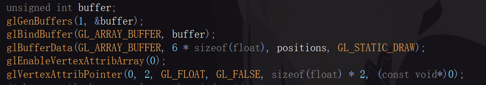

# OpenGL

## 顶点缓冲区的创建

1. 为顶点缓冲区分配id：

buffer用来存储缓存区的id序号

glGenBuffers为buffer分配唯一的id序号

glBindBuffer函数将buffer这个id序号接到GL_ARRAY_BUFFER这个通道上

glBufferData为这个缓存区分配对应的空间（第一个参数GL_ARRAY_BUFFER表示通道的类别，第二个参数表示的是开辟缓存区空间的内存大小，第三个参数为传入的数据，第四个参数表示不改变传入的顶点坐标信息）

glEnableVertexAttribArray打开对应的shader通道

glVertexAttriPointer就是告诉OpenGL对应的顶点坐标属性是什么，刚刚所做的操作只是开辟了空间大小，OpenGL本身并不知道我们传入的数据该怎么处理(好比我传入了一个float类型的数组，这个数组存储了六个数据，但是这在OpenGL看来只是普通的六个数而已，它不知道要怎么处理)，glVertexAttriPointer就是干这个的，这里顺带解释一下这六个参数是什么意思

### glVertexAttriPointer

第一个参数index：由于顶点可以有很多属性，除了坐标位置外，还可能有纹理，法线等等，这里的0表示的是把这组数据当成坐标处理

第二个参数size：表示这个坐标有几个属性，由于此处是二维平面，所以一个坐标只有两个参数(x,y)

第三个参数:表示传入的属性为浮点数类型

第四个参数normalized:由于在顶点着色器中，对顶点的属性有时采用标准化坐标计算(0~1之间的浮点数)，这个参数便是表示是否要对该属性做标准化处理，GL_FALSE表示不对该属性做标准化处理，GL_TRUE表示对该属性做标准化处理

第五个参数:这个参数指的是从一个属性跳到下一个属性的步幅，假设我们这里是连续三个二维平面的顶点坐标信息，由于一个坐标是由两个float类型的变量表示的，从一个坐标到下一个坐标之间的内存偏移量就是这个stride，相当于告诉OpenGL，每隔一个stride跳到下一个属性

第六个参数pointer:指的是读取数据的起始位置

这里需要注意一个区别，glVertexAttribPointer只记录规则，它并不实际读取，真正的读取是交给了glDrawArray去执行的，你可能不明白我说的什么意思，这里打个比方

如果glVertexAttribPointer负责实际的读取，如果我使用for循环

例如for(int i=0;i<3;i++)

{

…….

glVertexAttribPointer(i,………);

……..

}

用来读取不同的通道，在这种情况下，由于for循环的逻辑，我们先读取0着色器通道，再读取1着色器通道，再读取2着色器通道

但实际情况是，glVertexAttribPointer只负责记录读取规则

当你在调用glDrawElements/glDrawArrays的时候

这三个着色器通道的读取规则已经规定好了，之后开始同时读取

你可能会问，glVertexAttribPointer只指定规则不读取，这样有什么实际的应用意义吗

之前我们定义的positions这个属性中只单一存储了坐标属性，但在实际的应用中，其实在一个数组中可以存储多种属性，除了坐标，还有纹理，法线等

现在的布局是{P1,P2,P3,P4}但其实实际布局还可以是这样{P1,T1,P2,T2,P3,T3,P4,T4}

在读取的时候，使用for循环同时给所有的通道指定读取规则，好比坐标属性的通道的步长为2*sizeof(float)+sizeof(unsigned int),每隔两个坐标和一个纹理属性(其实我现在不知道纹理属性用什么数据类型，假设为unsigned int)，再读两个坐标，同样纹理属性的通道步长也是这么个大小，两个通道同时开始读同一个数组，不用一个通道先读，一个通道后读

对这个过程做一个形象的比喻:申请的缓存区id就像是一个u盘，GL_ARRAY_BUFFER就是usb插槽，你的所有操作都是通过这个插槽传给u盘的，只有当u盘插上插槽之后你才能对其进行操作，而且一个插槽只能查一个u盘

## 创建着色器(shader)

由于顶点着色器和片段着色器这两者往往是一起工作的，需要因此需要创建一个program，之后把顶点着色器和片段着色器”贴”在这个program中

在cherno的教程中，编译着色器和创建着色器/program被封装为了两个函数

### CompileShader

和创建顶点缓冲区的时候类似，shader在创建的时候也需要为其分配一个唯一的id

unsigned int id = glCreateShader(type);这段便是为着色器分配唯一的id标识

紧接着下面这一行代码开起来可能比较让人困惑，它其实就是将一个string类型的变量转变成了const char*这种原始的字符串类型，因为OpenGL是由C编写的，cpp的字符串不能作为参数传入

glShaderSource这个函数就是创建了shader的资源，把你写的需要编译的shader代码加载进了GPU中，1表示的是只有一串字符串，&src_cstr这个便是传入了src_cstr的指针，因为这里要传入一个字符串指针 ，而src_cstr本身是字符串的首地址，所以这里传入了一个二级指针,最后的那个NULL其实指的是字符串的长度，这里如果填NULL或nullptr的话指的是读到最后的\0停止

glCompileShader(id)便是对shader进行了编译

这样我们就成功编译了一个shader

注意到这里写了//TODO

因为着色器的编译其实不想visual studio那样会报编译错误，也就是说如果你的代码哪里写错了，你完全不知道，这里的作用其实就是做一个错误检查，如果shader代码编译错误了，你能在输出终端中看到报错信息，便于排查问题

result用来表示是否出现编译错误

这里使用if语句来判断，如果出现了编译错误(result==GL_FALSE)，则进一步输出编译错误信息，如果没有编译错误，则直接跳过

glGetShaderiv这个函数中的第一个参数id，指的是你需要访问的shader唯一id序号，GL_COMPILE_STATUS指的事查看编译状态，之后把这个结果传递给result

条件判断语句内的下一行代码，int length用于存储编译信息的字符串长度

message则将编译的报错以字符串的形式存储，这里并没有使用创建数组的方式来创建字符串数组，因为我们创建的数组长度是length，length本身是变量，而数组初始化的大小不能是一个变量，所以这里使用alloca的形式开辟连续的内存空间，之后强制转换为char*类型以满足需求

glGetShaderInfoLog这个函数的参数中，id指的是shader的唯一序号，第二个参数length其实指的编译信息的最大长度大小，第三个参数就有些让人困惑了，因为这里必须传入一个指针类型的变量，用来表示实际存储了多少个字符（第二个参数指的是存储字符的容量上限，第三个参数指当前存了多少个字符）因为接下来的一步便是将错误信息传给message，岁我们不需要知道当前实际存了多少个字符，这里cherno为了偷懒传进了&length，实际在当前情况下传什么指针都可以(哪怕是nullptr)

最后就是输出message，返回0(表示shader编译失败)

### Createshader

由于需要将shader创建在program下，所以CreateShader函数首先需要创建一个program，使用glCreateProgram（）创建program

接下来就是用之前写好的CompileShader一键创建shader

glAttachShader（program,vs_id）这段代码的意思是将你创建的id为vs_id的shader”装”进你创建好的program里，glAttachShader(program,fs_id)同理

glLinkProgram()：之前我们提到，顶点着色器和片段着色器是不能单独工作的，他们需要被连接在一起才能工作，glLinkProgram便是链接的关键，这个函数的参数中只需要填入你创建的program的id便可以，但是在调用该函数之前，一定确保你已经用glAttachShader把你创建的着色器挂在了这个program下，不然会出问题

glValidateProgram（program）:这里其实就是做了一个安检，举个例子，假如你在使用glLinkProgram之前，没有将对应的着色器挂在你创建的program下，此时glValidateProgram便会给你报错

glDeleteShader:你的shader其实已经创建完毕了，你可以把你创建好的shader类比为一个exe文件，exe文件的运行不依赖中间生成的obj文件，shader也类似，当你shader创建完毕后，你就可以把你的中间文件给删除了，不然留着会影响性能

## 编写着色器

你可能注意到了，我们是以字符串的形式传入着色器的代码的，但是这样做的话有很多坏处，你可能写着写着就少了一个换行，或者少了一个分号，而且也没有visual studio的高亮提示

所以一般情况下我们可以采用另一种方式来编写着色器代码，待会会讲到，现在先解释一下这段代码是什么意思

#version 330 core其实就是一个版本声明

layout(location=0),这里其实刚好对应了之前创建顶点缓冲区时的通道id(就是glEnableVertexAttribArray(0))，表明你的这个着色器是零号通道，顶点缓冲区通过这个通道使用对应的着色器

in表示后面这个参数是接收数据的，也就是接收你之前传入的position数据(这里的这个position只是变量名，它的名称可以是任意的)，vec4则是这个变量的类型声明，表明这个变量是一个四维矢量，你也许会问，我传入的是一个二维坐标，为什么这里会用到四维矢量，其实这里会对你传入的二维坐标进行自动补全，除开你传入的x，y方向的数据，y,z 方向上被自动补全为0.0,1.0

void main()和cpp的main函数类似，这里是程序的入口

gl_Position是着色器的内置属性，指的就是你顶点的坐标位置，这里其实能解释为什么要用四维矢量，因为这个内置属性就是一个四维的矢量，这里将你传入的坐标信息赋给了这个内置属性

片段着色器代码的编写也类似，这里稍微有一些不同的是，因为片段着色器负责渲染每个像素上的像素颜色，所以这里的color是一个输出的变量out，而且没有对应的内置属性,这里为什么没有对应的gl_color属性，未来会说到(画饼=v=)，你可能还会问，为什么着色器就知道你的这个变量对应的就是颜色这一属性呢，其实这就与layout有关，片段着色器的通道编号如果是零，那么对应的输出属性就默认为颜色

## 以读取文件文本的形式读取着色器代码

为了解决刚刚提到的直接在源文件中写着色器时遇到的不便，cherno给我们提供了一种解决方案:

单独创建一个shader文件，之后在里面一次性编写完着色器代码，最后在源cpp文件中使用fstream库和sstream库以字符串的形式读出文件中的shader代码

先单独创建一个res文件夹，再在其下创建一个shader文件夹(这里其实无所谓，但这样其实是一个好的习惯，方便你管理项目)，之后在shader文件夹里单独创建一个尾缀为.shader的文件

之后在shader文件中写入你的shader代码，按之前的原封不动的搬过来就可以，只不过这次不用加引号和换行符了，但是需要注意，我们需要在不同的着色器代码区域打上对应的标签，你马上就会知道为什么

先解释一下这个函数的大致思路吧，我们需要返回两个字符串，但是默认的函数只能返回一个对象，这里自定义了一个结构体，里面有两个字符串类型的成员变量用于存储我们的两个字符串，返回的时候只需要返回这个结构体对象就可以了，这样就可以一个函数同时返回多个值,这个函数的参数便是你的存放shader代码的文件路径，建议使用相对路径，这样就避免了因为项目路径更改而引发的不便

之后便是一行一行从文件中从文本形式读取shader代码，在这个过程中我们需要某种方式来区分你写的是Vertexshader代码还是fragmentshader代码，cherno在每个着色器的代码前都加了#shader “着色器名称”这种形式的标签，如果读到某一行有#shader就表明这里是某个着色器代码的起始部分，如果找到vertex或者fragment就更新type，这里的type是一个枚举类，这里cherno的用法非常巧妙，type起到了一人分饰两角的作用，既可以记录当前着色器的类型，又可以充当ss数组的索引(这里的ss是std::stringstream类型，这种类不单纯只是一个string，它是以流的方式处理字符串的（一个string流），因此在返回字符串值的时候，还需要用str()函数将对应的stringstream转化为字符串的形式输出

补充:ifstream其实就是input file stream，以输入的形式使用这个文件，getline(stream,line)则是以字符串的形式逐行读取stream，并把每一行的结果存入line中，使用while循环就是如果不为空就一直读，find()函数接收一个字符串类型，查找当前字符串中有没有对应的内容，如果没有的话就返回std::string::npos(no position)，有的话返回索引位置

## 索引缓冲区

由于在根据顶点绘制图案的时候，GPU只能绘制三角形，也就是说如果你传入正方形的四个顶点，GPU不会按你所想的那样绘制正方形，如果你想使用顶点缓冲区绘制正方形，你需要创建六个顶点，也就是绘制两个直角三角形，这样的话会造成性能浪费，明明绘制一个正方形只需要四个顶点就够了，结果我却要创建六个，如果只是绘制一个正方形倒还好，如果是绘制一个角色模型呢，那需要大量的三角形面，有无数个重叠的顶点，会造成相当大的性能浪费，OpenGL当然考虑到了这一点，索引缓冲区便是为了解决这一问题而生的

索引缓冲区的逻辑，其实就是按顶点缓冲区顶点的一定顺序进行绘制，好比你有四个顶点要绘制一个正方形，顶点的索引为0,1,2,3你可以按012顺序绘制一遍，再按123顺序绘制一遍，这样就得到了一个四边形，不需要创建六个顶点，要想有索引，必须先有顶点，因此在创建索引缓冲区之前，确保对应的顶点缓冲区已经创建

创建索引缓冲区的方法和创建顶点缓冲区的方法类似，先创建一个unsigned int类型的变量用于存储 唯一id，其余基本相同，只是缓冲区的通道变成了GL_ELEMENT_ARRAY_BUFFER,你可能会问，为什么传入了索引的数据它就知道我的各个顶点对应的索引是什么呢，这里其实有一个默认顶点顺序，分别按你传入坐标的顺序是0，1，2，3，你也许还会问，为什么它就知道我的默认顶点顺序是什么呢，因为你已经在GL_ARRAY_BUFFER通道插上了buffer，索引缓冲区会根据这个通道上的buffer的数据定好默认顺序

当你改为使用索引缓冲区绘制时，需要更改一下绘制的函数,将glDrawArray改为glDrawElements，第一个参数表示绘制的为三角形， 第二个参数是绘制的次数，第三个参数指的你传入的索引数据类型

## 如何使用glGetError处理OpenGL中的编译错误

因为OpenGL不像visual studio那样会给你报错，你在OpenGL中的错误默认你是不知道的，好比刚刚的glDrawElements函数，假如第三个参数你写的是GL_INT类型，这显然是一个错误，因为这里需要你写你的索引数据类型(unsigned_int)，但如果你没有意识到你的错误，你又点击了运行，你的hello world窗口以及输出终端中就什么也没有，没有绘制好的正方形也没有报错信息，我们当然不希望这样，我们想要的是像visual studio那样的报错，让我们知道哪里的代码写错了

glGetError函数内部存储着当前所有的错误标识，好比你的OpenGL编译时出现了三个错误，glGetError中便存储着这三个错误标识，但你每次调用的时候，只会返回其中的一个(之后glGetError中的这个错误标识便被移除了)所以需要不停的调用以返回所有的错误标识，不过这里有个问题，glGetError返回的错误码不会像visual studio那样标出来你哪里错了，它就是一个单纯的错误码，如果你一次性返回了很多错误，你怎么能知道对应的错误是在哪个位置发生的呢

这里我们可以写两个函数，一个函数用于清除所有已经有的Error标识，一个函数用于输出错误码，当我们想知道某行代码是否有错误的时候，只需要在这行代码之前删除所有的错误标识，在这段代码之后重新输出错误码即可，如果有错误码的话那只能是这行代码出错了

每次你想看某行代码是否有问题的时候都这样插入GLcleanError和GLCheckError未免太麻烦了，因此可以使用宏来简化

ASSERT(断言)，接收一个参数，后面是判断，如果条件为真则触发断点，反之不触发

__debugbreak是MSVC编译器自带的一个函数，用来触发断点

这里对GLCheckError函数做了一个修改，传入三个参数，一个是函数名，一个是文件名，一个是函数所在行数，__FILE__和__LINE__都是编译器自带的变量，前者是当前代码所在文件的文件名，后者是当前代码所在的行数

GLCALL(x)对之前的GLCleanError()和GLChecnError()的使用做了个简化，这样之后再次调用直接用GLCALL(这里填入你想查看的函数)即可

## 统一变量

当我们希望shader中的某个变量可以通过cpu中的指令访问时，便可以使用统一变量uniform

统一变量在物理层面上是属于整个program的，也就是说，在同一个program下，无论你在哪个着色器中创建了这个同一变量，它都属于整个program，并且每个变量都有唯一对应的location(假如你在vs中声明了一个名为a的uniform，在fs中声明了一个名为a的uniform，并且他们都是vec4类型，那么这两个变量其实就是同一个)。

统一变量的location是怎么确定的呢，其实当你在创建这个统一变量的时候，它的location就已经确定的，如果你没有显示声明layout(location= n,n为你想要的location)，那么系统会自动给你分配一个location，OpenGL通过这个唯一的location地址查询这个location下所在的变量

glGetUniformLocation()这个函数中，第一个参数填你要查询的program唯一id，第二个参数填你要查询的统一变量的变量名，之后返回一个location地址

glUniform的第一个参数是location，第二个参数是你想传入的值，它通过location访问这个地址里存储的变量，因为OpenGL在查询统一变量的时候依赖的就是location地址，它不看别的，也就是说如果你在同一个location下存储了多个统一变量，此时很可能会出问题，因为OpenGL不知道这个值要赋给这个location下的哪个变量

此处我声明的同一变量是一个vec4，也就是说我需要在第二个位置填入四个分量，这里任意一个分量都可以用变量来替代，你可以在这个函数之外控制这些变量从而控制颜色的变化。但是有一点需要注意的是，此处的颜色更新是取决于你的电脑帧率的，因为你更新变量大概率会把它放在while主循环中，如果你不想修改变量的变化逻辑，比如设定每次循环r值增加或减少0.05，但是又希望颜色变化的可以慢一些，我们就可以通过使用glfwSwapInterval来控制显示器的帧率

## glfwSwapInterval

这个函数的作用，其实就是控制垂直同步

函数的参数接收一个整数，这里为了解释这个函数的作用原理，需要解释一下电脑的画面是怎么刷新的。

双缓冲机制:

- **前置缓冲区（Front Buffer）：** 显示器当前正在读取并显示在屏幕上的那一帧画面。
- **后置缓冲区（Back Buffer）：** 你的 GPU 当前正在拼命渲染的新一帧画面。

当GPU的后置缓冲区画完后，OpenGL会通过glfwSwapInterval交换缓冲区，把后置缓冲区绘制好的画面更新在前置缓冲区上，但问题就是，显示器更新画面是从上往下一行行像素扫出来的，如果你的GPU(后置缓冲区)的绘制速度过快，显示器还没把这一次的前置缓冲区绘制完，就绘制更新好的后置缓冲区的话，就会导致显示器显示的一部分是上一次前置缓冲区的画面，一部分是刚刚后置缓冲区绘制好的画面，其实它有个我们更熟悉的名字，画面撕裂

为了避免这种情况，我们可以像glfwSwapInterval中传入一个整数，它控制的是缓冲区的交换时间间隔，意思是，需要等待几次屏幕刷新交换一次缓冲区

`glfwSwapInterval(0)`：彻底关闭 VSync

假如你的显示器最高帧率是240帧，而你向glfwSwapInterval中传入的整数为0，此时就相当于完全关闭了垂直同步，你的电脑帧率能跑多高跑多高，但就像前文所说的，难免会造成画面撕裂。

`glfwSwapInterval(1)`：开启标准 VSync

如果你的参数填的是1，表示显卡无论绘制的多快，也必须等屏幕绘制完一次后才能交换缓冲区，如果你显示器的最高帧率是240帧，那么此时最高帧率就被锁在了240帧

`glfwSwapInterval(2)` 或更高：降频锁帧

2意思是无论显卡绘制多快，也要等屏幕绘制两次之后才能交换缓冲区，如果显示器最高帧数是240，那么此时的最高帧数就被锁在了120,参数数值更大时依次类推

`glfwSwapInterval` 作用于当前的 OpenGL 上下文

必须在创建窗口，OpenGL上下文创立完毕后，才能写glfwSwapInterval

## 顶点数组对象(VAO)

顶点数组对象你可以把它想象成一个笔记本，它记录着顶点缓冲区的地址以及读取规则，在OpenGL3.3兼容版本中（这里只是拿Cherno教学视频中的版本举例），它有一个默认的顶点数组对象，所以在你创建顶点缓冲区和索引缓冲区之前，你不需要创建一个顶点数组对象，但是OpenGL3.3

核心版本中并没有提供这样的一个默认顶点缓冲区对象，如果你此时绑定了顶点缓冲区和索引缓冲区的话，不出意外地会报出编译错误

先来谈一下为什么OpenGL设计了顶点数组对象这样一个东西吧，在OpenGL早起的版本中，其实并没有这样的一个概念

早期版本中，你渲染图形的时候，需要在主循环中不断调用glBindBuffer,glEnableVertexAttribArray,glVertexAttribPointer这三个函数，但是我们在之前的教学中，你可以注意到，这三个函数写在主循环外面是没有问题的，现代版本中不需要在主循环中反复规定顶点缓冲区读取规则的原因就是因为顶点数组对象

想象一下，假如你的顶点缓冲区的读取规则是固定的，为什么要在主循环中反复调用glEnableVertexAttribArray和glVertexAttribPointer呢，如果有很多个顶点缓冲区，每次循环都调用一次这两个函数，这是额外的api开销,会造成不必要的性能浪费，所以才有了顶点数组对象(VAO)

顶点数组对象本身就像一个快照相机，当你每次调用glVextexAttribPointer的时候，它就会把此时顶点缓冲区的状态以及索引缓冲区的地址记录下来，之后GPU的读取管线便会去读顶点数组对象中记录的顶点缓冲区的地址以及读取的规则，依据顶点数组对象中存储的数据绘制

由于你每次调用glVertexxAttribPointer的时候，顶点数组对象都会记录此时顶点缓冲区的地址以及读取规则，同时也会记录索引缓冲区的地址，因此只要更新一次，顶点缓冲区上便会一直记录着这些数据，你无需重复调用glVertexAttriPointer，哪怕你把glVextexAttribPointer，glBindBuffer,glEnableVertexAttribArray这几个函数完全删除，只要顶点数组对象之前记录过一次顶点缓冲区的数据，OpenGL也能正常编译并绘制图案

### 如何创建一个顶点数组对象

和创建顶点缓冲区类似，先声明一个unsigned int类型的变量存储要创建的顶点数组对象的唯一id，之后使用glGenVertexArray分配唯一id，glBindVertexArray绑定顶点数组对象

如果你的OpenGL版本中没有默认顶点数组对象需要自己创建，务必把顶点数组对象的创建放在顶点缓冲区的创建之前，前面说过，因为每次你调用glVertexAttribPointer的时候会把数据记录到顶点数组对象中，如果你没有设定顶点数组对象，此时OpenGL大概会出现编译错误

## 顶点缓冲区和索引缓冲区的封装

封装的目的是为了更简单地调用代码，同时使代码的结构变得更加清晰，Cherno教程中带着我们封装也是出于这个目的，这里暂时不考虑后续扩展的情况，只考虑在我们目前已有代码的基础上进行封装

在封装的时候可以优先考虑封装的这个对象的功能是什么，我们需要调用的接口是什么，然后把对应的接口写在头文件中，之后再单独创建一个同名的cpp文件用来定义对应的函数，这样可以使我们的思路更加清晰

先解释一下为什么先在头文件中声明对应的函数再在对应的cpp文件中定义函数，这不单单是代码风格的问题，如果你把所有的接口都在头文件中声明，之后你使用这个头文件的时候，会把接口原封不动地调用过去，如果你在多个cpp文件中都使用了这个头文件，对应的代码将会重复编译，浪费性能

如果是现在头文件中声明再在对应cpp文件中定义，当你调用对应的接口时，每次都通过链接调用cpp文件中的唯一接口，避免了重复编译

cherno在对以前代码进行封装的时候，是直接复制粘贴过去的，我们自己封装的时候建议重写一遍，你大概会发现前面的某些函数已经忘的差不多了

### Renderer.h

这个头文件目前主要用于处理OpenGL中的编译错误(因为GLALL会贯穿整个OpenGL的使用)

### 顶点缓冲区的封装

假设我们有一个顶点缓冲区的头文件，我们希望创建顶点缓冲区的时候可以自动为其分配唯一的缓冲区id，但这个id又不能被外界直接访问，可以将其设置成类的私有成员，在构造函数中自动为其分配唯一id

创建顶点缓冲区的时候，需要使用glBufferData为缓冲区存入数据并分配大小，可以在创建顶点缓冲区实例的时候通过构造函数传入data和size，自动分配大小，在构造函数中也自动绑定缓冲区

这里Bind()接口单独写出来是为了方便以后其他接口的调用，UnBind用来手动解除缓冲区的绑定

这里便是具体api的定义，和之前在Application中写的内容几乎一致

这里的const表示只对类的成员变量进行读取，不更改

你可能会问，为什么glVertexAttribPointer和glEnableVertexAttribArray这两个函数没有在这里封装，在调这两个函数的时候，确定了顶点缓冲区的布局，而顶点缓冲区的布局实际上是由顶点数组对象负责记录的，我们希望把顶点缓冲区的布局存储交给顶点数组对象来处理，在后面顶点数组对象封装的时候才封装这两个函数

### 索引缓冲区的封装

与之前顶点缓冲区的封装几乎一致，将分配id，创建缓冲区，为缓冲区分配空间的功能都集成在了构造函数中，Bind()同样是为了方便其他接口的调用，UnBind()则是解除索引缓冲区的绑定，这里往索引缓冲区中写的索引个数是count，之前的顶点缓冲区对应位置写的size，cherno习惯把个数用count，而把占据的内存空间大小用size表示

## 顶点数组对象和缓冲区布局的封装

之前说过，顶点数组对象在glVertexAttribPointer和glEnableVertexAttribArray这两个函数调用的时候记录顶点缓冲区的地址和布局，按照面向对象的设计哲学，既然顶点数组对象负责了缓冲区布局的读取，我们就把这两个函数封装在顶点数组对象中

cherno这里把缓冲区对象单独分装，是考虑到我们以后可能会在cpu中读取缓冲区的布局，比如通过顶点缓冲区的布局来做碰撞检测，单独封装缓冲区的布局有助于后续的调用

而顶点数组对象的功能主要是读取缓冲区的布局

这样大致就有了封装的思路

缓冲区布局用来存储缓冲区的布局，顶点数组对象读取并记录缓冲区的布局

### 缓冲区布局的封装

先想一下当我们告诉顶点缓冲区它的布局的时候，都需要哪些信息

1.需要知道数据对应的哪个着色器通道

2.需要知道传入了多少个数据

3.需要知道传入的数据类型

4.需要知道数据是否经过标准化处理

5.需要知道步长

6.需要知道从哪个地址开始查询

其中着色器通道，是否经过标准化处理，一般是有默认规则的

我们知道顶点着色器的不同通道表示顶点的不同属性，比如零号通道表示顶点的坐标

而顶点的坐标一般用浮点类型的数据表示，浮点类型一般也不需要通过标准化处理

所以cherno这里希望通过判断你在布局中存储的数据类型，自动判断对应的着色器通道和是否需要标准化处理，不需要单独的参数传入和在缓冲区布局对象中存储

除去了这两个信息，就剩下四个布局信息了，传入数据的个数，传入数据的类型，步长以及查询首地址，而步长和首地址又可以通过数据类型和传入的数据个数进行计算

实际真正需要记录的布局信息就只有传入数据的个数和数据类型，其它数据都可以据此推断

单独创建头文件VertexBufferLayout来存储数据信息，创建VertexBufferElement来表示单个布局类，主要存储两个信息count(个数)和type(类型)，normalized根据type自动判断

由于顶点缓冲区可能有多个，布局也可能有多个，最适合用来做容器的对象便是vector，动态更新存储数组的个数，由于我们存储的布局可能具有不同的数据类型，需要根据数据类型的不同动态地存储布局，于是在这里使用了template，你可能会问，在调用函数的时候直接把数据类型顺带作为参数填入不行吗?答案是肯定的，当然可以，但是使用template有很多好处

在定义模版的时候，可以通过static_assert来在编译期就显示错误，假如你使用传参的方式写这个函数，需要存入的布局数据类型是unsigned int类型，结果你写成了float，结果编译期你没发现这个错误，而在程序运行的时候可能就出现了一系列问题，在模版中使用static_assert就起到了一个未雨绸缪的作用，不仅如此，如果你将数据类型作为参数传入，你还需要在函数定义中写很多条件判断分支，这产生了一定的性能开销，使用模版则是在编译期就确定了函数，避免了性能开销，你可能又会问，我用函数的重载不行吗，函数的重载确实能够避免条件判断，但是函数要想重载，必须填入对应类型的参数，想象一下，你每次调用Push的时候，除了传入count，你还需要传入一个数字启用函数重载，浮点型要写Push(count ,任意一个浮点数)，这看起来会非常奇怪，调用的时候也不美观

综上所述，template是最优的

这里的template <typename T>表示要创建一个函数模版， template<>下面的函数都是这个模版的不同具体实现

你也许惊讶的发现我们这里将步长作为了这个类的私有成员，而不是作为VertexBufferElement的私有成员，因为步长是所有的布局所共用的，而不是某个单一布局的属性

举一个之前的例子

在实际应用中，顶点的属性往往是交替排列的，假设我的一个数组存储了顶点的坐标属性，纹理属性

坐标纹理属性交替布局，数组长这样

{P1,T1,P2,T2,P3,T3}

那么无论是顶点属性通道的步长，还是纹理属性的步长，他们的大小都是同一个值

所以步长是所有布局统一的，不应该设置成某个单一布局的成员变量

这里步长的计算也是基于这个原理，每加入一个新的布局，m_Stride就加上这个布局中数据类型的size

### 顶点数组对象的封装

和顶点/索引缓冲区类似，创建顶点数组对象的时候我们同样希望自动分配唯一id，顶点数组对象的删除则由析构函数自动处理

此处着重解释一下AddBuffer函数

我们将缓冲区布局和顶点数组对象的封装解耦，造就了这个富有美感的函数

这个函数有两个参数，一个事之前封装的顶点缓冲区对象，一个是之前封装的顶点缓冲区的布局

顶点数组对象的作用就是记录某个顶点缓冲区布局的读取规则

在学习顶点数组对象之前，学习顶点缓冲区的时候，我们就写了glVertexAttribPointer和glEnableVertexAttribArray，但是在当时我们是不知道这两个函数和顶点数组对象息息相关，甚至在讲解顶点数组对象的时候可能也没有意识到这一点

这个函数的两个参数很好地体现了顶点数组对象的实际功能，当你想通过顶点数组对象记录对应的读取规则时，你不用再复杂地调用glVertexAttribPointer，只需要通过这个函数，填入你想记录的缓冲区，再填入这个布局，就对这整个功能进行了实现，而且意图也特别明显，十分利于理解，它很好地表达了顶点数组对象，顶点缓冲区，顶点缓冲区的布局这三者之间的关系

这个函数也不复杂，先绑定对应的顶点缓冲区，之后获得这个缓冲区所有属性的布局(使用引用避免了拷贝)，之后设置了所有布局的读取规则

这里的offset可能有点不好理解，还是拿之前那个属性交错排列的数组举例子

{P1,T1,P2,T2,P3,T3,P4,T4}这里是两个属性，i为2(先push坐标属性，类型为float，再push纹理属性)

结合这个for循环来看，第一次循环，因为我们的坐标属性是从数组的第一个位置开始读的(注意，是此时只是指定读取规则，没有真正读取)，所以offset是0，第二次循环中，纹理属性是从第二个位置开始读的，第一个元素跳过去了，所以就offset为size*element.count，